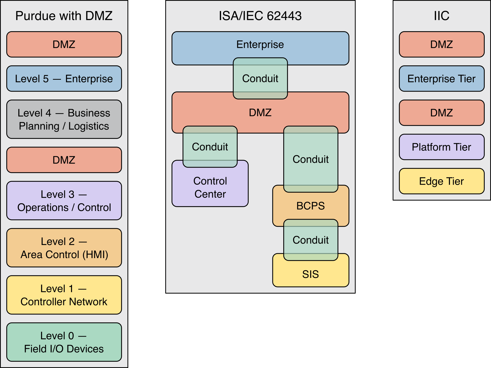

# 纵深防御架构能力

许多组织正在推进数字化转型计划，这要求他们调整运营技术（OT）环境，并制定能够构建多层信息架构的战略，以支持组织目标，例如：

- 现场设备的维护、遥测数据采集或工业级过程系统；
- 增强数据采集与分发能力；
- 远程访问。

总体而言，随着组织不断适应本地及全球不断变化的需求和要求，IT 与 OT 之间的融合程度正在加深。运用纵深防御架构的原则，系统性地分层部署安全控制措施 —— 包括人员、流程和技术 —— 有助于组织加强其整体网络安全防御能力。因此，攻击者若想在不被察觉的情况下渗透到该环境中，将面临越来越大的困难。以下小节将探讨 “纵深防御” 架构的具体层级，并提供组织在制定和实施纵深防御网络安全架构时，应考虑的主题与思路。这些层级包括：

- 第 1 层 —— 安全管理；
- 第 2 层 —— 物理安全；
- 第 3 层 —— 网络安全；
- 第 4 层 —— 硬件安全；
- 第 5 层 —— 软件安全。

## 第 1 层 —— 安全管理

安全管理或治理，属于支撑运营技术（OT）环境的总体网络安全计划。[第 3 部分](../program_dev.md) 和 [第 4 部分](../risk_management.md) 探讨了组织在建立网络安全计划时，应考虑的计划和风险管理事项。这些计划性及组织性决策，将指导并影响针对其他纵深防御层所做的决策。因此，组织应在尝试实施其他层之前先完成这一层。

## 第 2 层 —— 物理安全

物理安全措施旨在降低资产及周边环境因意外或蓄意行为，而遭受损失或损坏的风险。受保护的资产可能包括

- 控制系统、
- 工具、
- 设备、
- 环境、
- 周边社区、
- 以及知识产权（包括专有数据，例如工艺参数和客户信息）。

组织在实施物理安全措施时，还需考虑环境、安全、法规、法律及其他方面的额外要求。

针对物理安全的纵深防御解决方案应考虑以下要素：

- **物理场所的保护**。经典的物理安全考量，通常包括构建分层安全措施架构，在建筑物、设施、房间、设备及其他信息资产周围设置多重物理屏障。应实施物理安全控制措施以保护物理场所，这些措施可能包括围栏、防车壕沟、土墩、围墙、加固路障、大门、门锁和机柜锁、守卫或其他措施；
- **物理访问控制**。设备机柜在无需用于运行或安全保障时应上锁，布线应整齐有序，并收纳于机柜内或地板下方。此外，应考虑将所有计算和网络设备放置在受保护区域。PLC（可编程逻辑控制器）和安全系统等运营技术（OT）资产的钥匙，除非正在进行编程操作，否则应始终保持在 “运行” 位置；
- **出入监控系统**。出入监控系统包含电子监控功能，例如静态和视频摄像头、传感器以及身份识别系统（如门禁卡读卡器、生物识别扫描仪、电子密码键盘）。此类设备通常不会阻止人员进入特定区域，而是用于存储和记录人员、车辆、动物或其他物理实体的在场或缺席情况。应根据部署的出入监控设备类型提供充足的照明。这些系统有时还能在检测到未经授权的出入时发出警报或启动相应措施；
- **人员与资产追踪**。出于安全与安保的双重考虑，定位设施内的人员和车辆至关重要。资产定位技术可用于追踪人员和车辆的移动轨迹，以确保其留在授权区域内，识别可能需要协助的人员，并为应急响应提供支持。

> **特定于运营技术（OT）的建议与指导**
>
> 组织应考虑远程资产的物理安全措施是否存在不同层级的实施情况，以及这些差异是否可能引发网络安全风险。例如，某个远程站点可能仅使用挂锁并辅以最低限度的电子监控来保障网络设备的访问安全；若该安全措施被绕过，恶意行为者便可能从该远程站点进入 OT 网段。
>
> 组织还应考虑支持物理安全设备（如摄像头、传感器等）的辅助服务（例如通信和供电）是否需要额外的冗余、隔离、保护和监控措施。

## 第 3 层 —— 网络安全

在物理安全的基础上，组织应深入研究网络通信，并探讨如何保护用于支持其 OT 环境的数据和设备。这一小节重点介绍若干基础要素，以协助组织规划和实施其网络安全能力。这些要素包括

- 应用网络架构中的分段与隔离原则、
- 集中日志记录、
- 网络监控以及恶意代码防护。

此外，这一小姐还将探讨零信任架构，zero trust architecture, ZTA，以及将这些架构增强措施应用于 OT 环境时的注意事项。

### 网络架构

网络架构的最佳实践是针对 IT 和 OT 设备进行特征描述、分段和隔离。例如，可以根据

- 管理权限、
- 信任级别、
- 功能关键性、
- 数据流、
- 位置、
- 或其他逻辑组合

对设备进行分段。组织还可以考虑采用行业公认的模型，来组织其 OT 网络分段，例如

- 普渡大学模型，the Purdue model, 【[Williams](../refs.md#williams)】、
- ISA-95 层级 【[IEC62264](../refs.md#iec62264)】、
- 三层 IIoT 系统架构 【[IIRA19](../refs.md#iira19)】，
- 或这些模型的组合。

此外，组织可考虑将 DMZ 作为网络分段之间的执行边界，如下 [图 16](#f-16) 所示。通过利用层级、分层或区域来实施网络分段，组织既能控制对敏感信息和组件的访问，又能兼顾运营性能和安全性。

**图 16**：普渡大学模型和 IIoT 模型在包含 DMZ 分段的网络分段中的高层次示例

> **特定于 OT 系统的建议与指导**
>
> 无论采用基于风险的方法、功能模型还是其他组织原则，将组件划分为不同层级、级别或区域，都是组织在考虑应用隔离装置，以保护和监控层级、级别或区域之间的通信之前必须进行的准备工作。在对资产进行组织时，组织应考虑区域和隔离配置对其日常运营、安全及响应能力的影响。

当配置得当时，网络架构可以通过强制执行安全策略和控制网络通信，来支持网络分段和隔离。组织通常利用其映射的数据流，来识别必要的通信。随后，这些要求会被纳入网络架构，并配置到网络设备的策略引擎中，以支持对分段之间通信的监控，并仅允许经过授权的通信。支持流量强制执行功能的网络设备（例如交换机、路由器、防火墙以及单向网关或数据二极管），可用于实现网络分段和隔离。

防火墙通常用于实现网络隔离，并作为边界防护设备，用于控制网络分段之间的连接和信息流。防火墙既可以作为网络设备部署，也可以直接在某些主机上运行。防火墙是一种非常灵活的隔离设备，通常是保护运营技术（OT）设备的主要机制。

> **特定于运营技术（OT）的建议与指导**
>
> 适当的防火墙配置对于有效保障网络分段的安全至关重要。应制定防火墙规则集，仅允许相邻层级、层或区域之间的连接。例如，采用普渡模型架构的组织，应实施防火墙规则和连接路径，以防止第 4 层设备与第 2 层、第 1 层或第 0 层设备直接通信。类似的概念也适用于 ISA/IEC 62443 和 IIC 架构。
>
> 在防火墙规则的实际应用中，一个存在显著差异的领域是控制网络出站流量的管控。若未加以管理，允许来自较低层级、分层或区域的出站连接，可能带来重大风险。组织应考虑将出站规则制定得与入站规则同样严格，以降低这些风险。
>
> 防火墙的替代方案是单向网关或数据二极管，其仅允许授权通信单向进行。使用单向网关可针对环境内更高层级或分层中的系统遭入侵时提供额外防护。例如，部署在第 2 层与第 3 层之间的单向网关，可保护第 0 层、第 1 层和第 2 层设备免受发生在第 3 层、第 4 层或第 5 层的网络安全事件的影响。

### 集中式日志记录

应将网络和计算设备（例如路由器、网关、交换机、防火墙、服务器和工作站）配置为记录事件，以支持监控、告警和事件响应分析。应用程序、操作系统和网络通信通常都具备记录事件的日志功能。集中式日志管理平台可协助组织开展日志保留、监控和分析工作。

> **特定于运营技术（OT）的建议与指导**
>
> 组织应审查其现有的日志记录功能，并进行配置以记录适合其环境的运营和网络安全事件。
>
> 组织应确定事件日志的保留期限，并确保有足够的存储空间来满足日志保留要求。

### 网络监控

网络监控包括审查警报和日志，并对其进行分析以发现可能的网络安全事件迹象。支持

- 行为异常检测，behavior anomaly dectection, BAD、
- 安全信息和事件管理，security information and event management, SIEM、
- 入侵检测系统，intrusion detection systems, IDS、
- 以及入侵防御系统，intrusion prevention systems, IPS

的工具和功能，可协助组织监控整个网络的流量，并在识别出异常或可疑流量时触发警报。网络监控还应考虑以下其他功能：

- 资产管理，包括发现并清点连接到网络的设备；
- 建立典型网络流量、数据流及设备间通信的基线；
- 诊断网络性能问题；
- 识别网络设备的配置错误或故障。

组织还可能需要考虑整合其他服务和功能，例如威胁情报监控，threat intelligence monitoring, 以协助建立和维护有效的网络监控能力。

> **特定于 OT 的建议与指导**
>
> 与 IT 网络流量相比，OT 系统流量通常更具确定性（即可重复、可预测且经过设计），可利用这一点支持针对异常和错误检测的网络监控。
>
> 组织应了解 OT 网络的正常状态，这是实施网络安全监控的先决条件，有助于区分攻击与环境中的瞬态状况或正常运行。以被动模式（例如监听或学习模式）实施网络监控，并分析信息以区分已知和未知的通信，可能是实施网络安全监控的必要第一步。
>
> 组织应考虑加密网络通信对其网络监控能力和部署策略的影响。例如，BAD 系统或 IDS 可能无法判断加密网络通信是否具有恶意，从而针对该流量产生误报或漏报。当预计存在加密通信时，将数据采集点调整为在 *加密前* 或 *加密后* 捕获网络流量（例如使用基于主机的网络监控工具），有助于提升监控能力。
>
> IDS 和 IPS 产品在检测和防范已知的互联网攻击方面非常有效，部分 IDS 和 IPS 供应商已整合了针对各种 OT 协议，如
>
> - Modbus、
> - 分布式网络协议 3，Distributed Network Protocol 3,
> - DNP3 和控制中心间通信协议，Inter-Control Center Communications Protocol, ICCP
>
> 的攻击特征码。有效的 IDS/IPS 部署通常需要同时具备基于主机和基于网络的监测能力。
>
>
> 组织在部署入侵防御系统（IPS）前，应考虑其自动响应机制可能对运营技术（OT）环境造成的影响。在某些情况下，企业可考虑将 IPS 设备部署在环境中的更高层级（例如 DMZ 接口），以最大限度地减少自动响应对 OT 环境造成的影响。
>
> 在 OT 环境中，基于网络的监控功能通常通过交换端口分析器，switched port analyzer, SPAN 端口，或被动式网络分流器部署在边界防护设备上。组织还应考虑在兼容的 OT 设备（如 HMI、SCADA 服务器和工程工作站）上部署基于主机的监控功能，以增强监控能力，前提是这些工具的添加不会对运营性能或安全造成不利影响。

### 零信任架构，Zero Trust Architecture, ZTA

零信任架构（ZTA）属于一种网络安全范式，专注于保护资源（例如信息服务、数据），其前提前提是授权决策更接近被请求的资源，并持续评估而非隐式授予 【[SP800-207](./refs.md#sp800-207)】。传统网络安全主要侧重于网络分段和边界防御。一旦进入网络边界，用户通常被视为 “可信”，并常被授予对可用资源的广泛访问权限。因此，区域之间的边界防护设备，无法缓解区域内的横向移动风险。此外，随着分布式计算、无线和蜂窝通信以及云和混合云环境的日益普及，传统的网络边界和界限正变得日益模糊。针对这些情况，组织可考虑将零信任原则融入其安全架构中。

实施零信任架构（ZTA）面临的一些挑战包括：

- 组织可能无法找到适合零信任架构的单一解决方案，而需要整合多种成熟度各异的技术来支持其环境；
- 将零信任原则融入现有环境，可能需要在时间、资源和技术能力方面投入更多。

> **特定于 OT 的建议与指导**
>
> 某些 OT 组件（例如 PLC、控制器、HMI）可能不支持与 ZTA 实施完全集成所需的技术或协议。因此，对于某些 OT 设备，ZTA 部署可能并不现实。相反，组织应考虑将 ZTA 应用于兼容设备，例如通常位于 OT 架构更高功能层级的设备（例如普渡模型第 3、4、5 层以及 OT DMZ）。
>
> 组织还应考虑是否可能产生任何不利影响，例如 ZTA 解决方案是否会增加响应资源请求的延迟，或者一个或多个 ZTA 组件是否会出现不可用情况。基于此分析，组织应考虑调整 ZTA 的实施方式，以最大限度地降低延迟，并确保足够的冗余性，从而将对 OT 和安全运营的风险降至最低。
>
> ZTA 实施的另一个重要方面是访问资源的人员和非人员实体的身份。在 OT 环境中，可能会使用共享凭据，这可能会影响 ZTA 解决方案的全面实施。

## 第 4 层 –- 硬件安全

硬件安全保护机制为环境中的设备提供了安全与信任的基础。一旦建立了设备信任，就必须根据系统模型和策略，来维护和跟踪其状态。为了支持这些功能，一些供应商提供了嵌入式技术，例如可信平台模组，Trusted Platform Module, TPM，或者高级加密标准，Advanced Encryption Stardand, AES）和安全哈希算法，Secure Hash Algorithm, SHA 的硬件实现。总体而言，硬件安全能力通过增强终端设备，以满足特定的功能和安全需求，包括：

- 监控与分析；
- 安全配置与管理；
- 终端加固；
- 完整性保护；
- 访问控制；
- 设备身份；
- 信任根；
- 物理安全。

> **特定于运营技术（OT）的建议与指导**
>
> 组织应审查现有的硬件安全措施和自动化能力，以确定如何在不影响运营性能、安全或功能的前提下，为运营技术（OT）环境提供支持。

## 第 5 层 —— 软件安全

软件安全保护机制为组织提供了确保支持运营技术（OT）的应用程序和服务，得到正确使用和维护的能力。总体而言，当组织采用以下措施时，软件安全能力可增强终端安全：

- 应用程序白名单；
- 补丁管理；
- 安全代码开发；
- 配置管理，包括应用程序加固。

### 应用程序白名单

应用程序白名单技术通过限制允许执行的应用程序，为主机提供了一种额外的保护机制。当配置得当时，未经授权的应用程序将无法在主机环境中执行。

> **特定于 OT 的建议和指导**
>
> OT 环境相对静态的特性，为组织提供了将应用程序白名单纳入其深度防御策略的机会，这也是 [美国国土安全部 DHS 推荐的最佳实践](https://www.cisa.gov/sites/default/files/recommended_practices/NCCIC_ICS-CERT_Defense_in_Depth_2016_S508C.pdf)。在考虑于 OT 环境中实施应用程序白名单时，组织应与供应商协调，并查阅现有的实施指南，例如
>
> - NIST SP 800-167 *《应用程序白名单指南》* 【[SP800-167](./refs.md#sp800-167)】、
> - [《工业控制系统应用程序白名单指南》](https://www.cisa.gov/sites/default/files/documents/Guidelines%20for%20Application%20Whitelisting%20in%20Industrial%20Control%20Systems_S508C.pdf) 、
> - 或行业的相关指南。
>
>
> 在部署之前，应彻底测试配置和策略，以确保规则和设置能够正确支持组织的安全目标。

### 打补丁

补丁主要有两个目的：修复漏洞和增强功能。在深度防御软件安全框架下，打补丁主要与降低漏洞风险相关。因此，补丁管理作为深度防御能力之一，是组织风险管理策略中支持漏洞管理的重要环节。

将补丁部署到运营技术（OT）环境时，组织需要考虑更多因素，包括测试和验证，以确保补丁不会影响运营能力或安全性。OT 运营要求也会影响补丁的部署频率。例如，某些 OT 环境必须长时间近乎不间断地运行，或者仅有很短的维护窗口期来应用已批准的更新。此外，对于运行在已停止支持的操作系统上的旧版 OT 组件，可能无法进行补丁更新。在这种情况下，组织可能需要考虑更新操作系统，或投资于额外的控制措施，以保护环境免受针对已知漏洞的攻击。某些工具（如 Web 应用防火墙, web application firewalls, WAF 和入侵防御系统 IPS）可进行配置，在组织等待更新机会期间，提供额外保护以检测或阻止针对未修补漏洞的攻击。其他工具（如线内安全设备，bump-in-the-wire security devices）可部署在无法更新，或使用过时操作系统的设备前端。

> **特定于运营技术（OT）的建议与指导**
>
> 在条件允许的情况下，应在沙箱系统（即测试环境）上对补丁进行测试，以确保其在部署到生产系统之前不会引发问题。组织应在环境的计划维护时段内安排补丁和更新工作，并针对正在进行补丁更新的运营技术组件或系统制定恢复计划。
>
> 组织还应考虑到，不同的层级、级别和区域可能具有不同的可用性要求，因此支持补丁更新的能力也可能各不相同。在条件允许的情况下，组织应优先对 DMZ 环境中的组件进行补丁更新，特别是当存在影响可用性和完整性的漏洞，或可能导致未经授权的远程访问进入 OT 环境时。

### 安全代码开发

开发内部系统和组件的组织，应在其网络安全计划中纳入支持并验证安全代码开发实践的政策和程序。软件开发生命周期，software development life cycle, SDLC 应在软件开发的每个阶段，都纳入安全考量。这应包括针对以下各流程的安全审查和编码技术：

- 使用或开发工具来审核和自动化安全编码技术；
- 测试和审查代码以确保符合安全编码规范；
- 测试软件以发现编程中的安全错误。

对于从第三方采购组件或服务的组织，在与供应商签订合同之前，应考虑审查这些相同的实践。组织可以通过在其服务级别协议及采购行动中要求这些实践，帮助行业朝着更安全的产品方向发展。

### 配置管理

采用支持安全配置和应用程序加固的配置管理实践，对于满足组织和监管机构的安全要求至关重要。这些设置可能包括配置访问控制以限制访问，或启用加密以保护静止数据或传输中的数据。应用程序加固流程可能包括禁用或封堵

- 特定的网络通信端口、
- 应用程序功能，
- 或系统上运行的非必要服务。

对网络传输中的数据（即传输中的数据）或存储在内存及本地存储中的数据（即静止数据）进行加密，也可用于防御 OT 系统。加密可防止攻击者查看或修改明文数据流。由于加密及随后的解密过程使用算法生成密文，加密会增加延迟，因此可能并不适用于所有 OT 设备。了解加密的优缺点，有助于组织在制定深度防御策略时，明智地决定在何处采用加密措施。

> **特定于运营技术（OT）的建议与指导**
>
> 当连接必须经过非 OT 网络段（如企业网络或互联网）时，组织应考虑使用加密技术，以支持 OT 环境中的安全连接或传输通道。虚拟专用网络，virutal private network, VPN 连接也应采用加密协议，如传输层安全协议，Transport Layer Security, TLS 或互联网协议安全，Internet Protocol Security, IPsec 来保障数据安全。
>
> 加密技术也可应用于本地硬盘存储，以保护静止状态下的信息。建议对便携式笔记本电脑和设备采用全盘加密。组织机构还可考虑对包含敏感文件的文件夹进行加密。
>
> 组织机构还必须考虑到，加密可能会对其他防御工具（如网络监控）产生负面影响。例如，入侵检测系统 IDS 可能无法判断加密数据包是否具有恶意，从而导致误报或漏报。
>
> 组织还应制定流程来管理控制逻辑的变更，以防范未经充分测试，或恶意的逻辑变更导致系统中断的风险。
