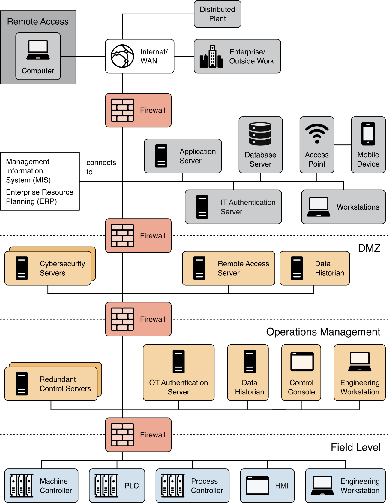
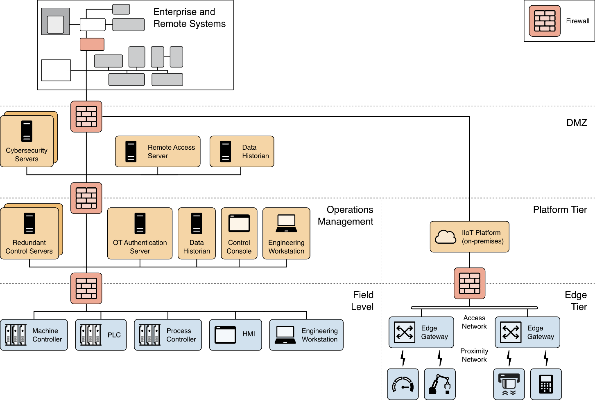
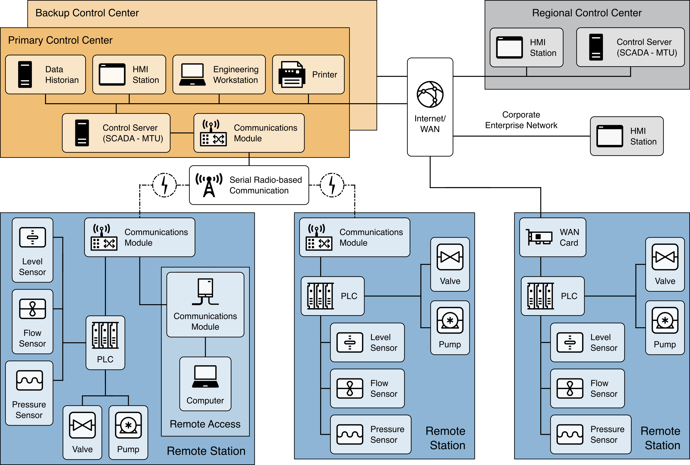
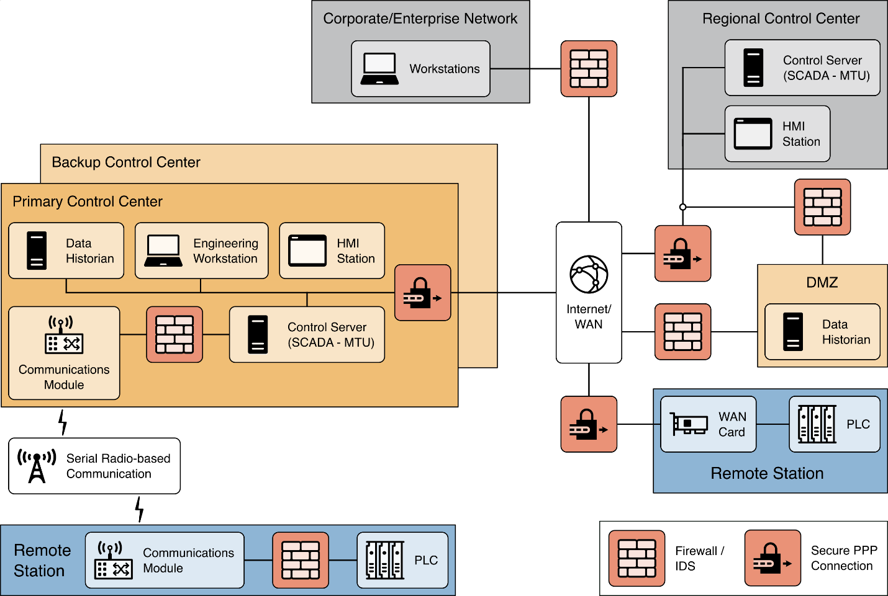

# 网络安全架构模型

基于第 [5.1](./strategy.md)、[5.2](./capacities.md) 和 [5.3](./other_considerations.md) 小节中的概念和指导原则，以下各小节将对 [第 2 部分](../program_dev.md) 中描述的一般 OT 和 IIoT 环境进行扩展，并提供示例说明如何调整这些环境，以支持深度防御安全架构。

## 基于分布式控制系统（DCS）的 OT 系统

如 [第 2 部分](../program_dev.md) 所述，分布式控制系统（DCS）用于控制工业领域内同一地理位置的生产系统。下 [图 17](#f-17) 展示了一个 DCS 系统实施的示例。下 [图 18](#f-18) 展示了一个应用于 DCS 系统的深度防御架构示例。

**图 17**：一个 DCS 实现的示例

**图 18**：DCS 系统的深度防御安全架构示例

在图 18 中，假设该组织已解决了第 1 层和第 2 层。对于第 3 层，该组织应考虑将以下功能纳入安全架构：

- 将网络划分为不同的层级或区域。在此示例中，设备根据功能被划分为不同的层级。现场层包含通常位于普渡模型第 0、1 和 2 层的设备。运营管理层包含用于监控和管理现场层设备，以及普渡模型第 3 层组件的设备。DMZ 包含支持连接运营管理层和企业层的设备。组织还应考虑安全或安防系统（例如物理监控与访问控制、门、闸机、摄像头、网络电话 [VoIP]、门禁卡读卡器等）是否需要额外的网络分段。网络分段是实施深度防御策略的重要步骤；
- 添加边界设备（例如防火墙），以控制和监控不同层级之间的通信。有时会在现场层与运营管理层之间部署工业级防火墙，以提供对 OT 专用协议的额外支持，或确保设备能在恶劣环境中正常运行。应定义入站和出站通信规则，确保仅允许授权通信在相邻层级之间通过；
- 部署 DMZ（隔离区）以将 OT 环境与企业网络隔离。企业层与运营管理层之间的所有通信，都必须通过 DMZ 内的服务进行。由于 DMZ 连接外部环境，因此必须对 DMZ 内的服务进行监控和保护，以防止安全漏洞导致攻击者在未被察觉的情况下向 OT 环境渗透；
- 安全架构图显示，企业网络中部署了一个用于验证用户身份的 IT 身份验证服务器，而在运营管理网络中则为 OT 用户部署了一个独立的 OT 身份验证服务器。当这种方法符合组织的基于风险的安全目标时，组织可考虑采用此方案。

对于第 4 层和第 5 层，组织应考虑对所有现场设备、运营管理设备和 DMZ 设备，均应用 “最小功能” 原则，以支持应用程序和设备的加固。组织应识别并禁用设备上的任何非必要功能、软件或端口。例如，某些较新的 PLC 或 HMI 可能内置 Web 服务器或 SSH 服务器。若未使用这些服务，应将其禁用，并同时禁用相关的 TCP/UDP 端口。仅在必要时启用相关功能。

## 基于 DCS 和 PLC 的 OT 系统与 IIoT

建立在上一小节中关于基于 DCS 和 PLC 的 OT 环境的指导原则，下 [图 19](#f-19) 展示了一个简化的 DCS 系统安全架构实现示例，其中增加了配置为利用本地 IIoT 平台，提供计算能力的 IIoT 设备。鉴于支持 IIoT 的通信和架构组件各不相同，该示例展示了用于支持新增 IIoT 组件的独立网络分段。来自 IIoT 平台层的通信，通过 DMZ 边界防火墙进行路由，以便组织根据 IIoT 运营需求，将数据传输至 DMZ 内的服务器或企业网络/互联网。此外，这还允许位于 DMZ 内的网络安全服务对 IIoT 平台层进行监控。

**图 19**：包含工业物联网设备的分布式控制系统 DCS 的安全架构示例

## 基于 SCADA 的运营技术（OT）环境

下 [图 20](#f-20) 展示了一个 SCADA 系统的组件实现示例及其总体配置。通常，主控中心和备用控中心会根据地理位置，支持一个或多个远程站，而区域控中心则分布在不同地理位置，以支持一个或多个主控中心或备用控中心。由于远程站和控制中心具有分布式特性，各站点之间的通信通常通过无线或有线介质，经由外部或广域网（WAN）连接进行。

**图 20**：OT 环境中的 SCADA 系统示例

下 [图 21](#f-21) 展示了一个 SCADA 系统的深度防御实施示例，该示例假设组织已处理了第 1 层和第 2 层的安全问题。对于第 3 层，组织应考虑在安全架构中纳入以下能力：

- 将网络划分为不同的区域或分区，这对在 SCADA 环境中实施深度防御策略至关重要。应考虑对安全系统（例如物理监控和访问控制、门、闸、摄像头、VoIP、门禁卡读卡器）进行额外隔离；
- 在不同区域之间部署边界设备（例如防火墙），以控制和监控网络分段之间的通信。工业级有状态防火墙可能对运营技术（OT）专用协议提供更全面的支持，并增强对 PLC 和控制器等 OT 设备的保护。应制定入站和出站通信规则，确保只有经过授权的通信才能在区域之间通过；
- 在网络分段之间（例如区域中心与主控制中心之间，以及远程站与控制中心之间）使用安全连接（例如 VPN 隧道、加密通道、点对点连接）。对于地理位置分散的站点，可通过互联网/广域网（WAN）建立安全连接。网络分段中的设备，应仅通过安全连接与其他分段建立连接，且访问互联网时应受到限制；
- 部署一个 DMZ，将控制中心与企业网络隔离。企业网络与控制中心之间的任何通信，都必须通过 DMZ 内的服务进行。由于 DMZ 连接到外部环境，因此必须对 DMZ 内的服务进行监控和保护，以防止 DMZ 内部遭到入侵，从而避免攻击者在未被察觉的情况下向 OT 环境渗透。

**图 21**：SCADA 系统的安全架构示例

对于第 4 层和第 5 层，组织应考虑对所有远程站组件、控制中心组件和 DMZ 设备应用 “最小功能” 原则，以支持应用程序和设备的加固。组织应识别并禁用设备上的任何非必要功能、软件或端口。例如，某些较新的 PLC 或 HMI 可能内置 Web 服务器或 SSH 服务器。如果这些服务未被使用，应将其禁用，并关闭相关的 TCP/UDP 端口。仅在必要时启用相关功能。
