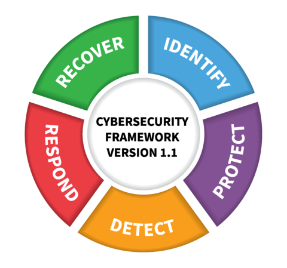

# 应用网络安全框架于 OT

许多公共和私营部门组织，已采用美国国家标准与技术研究院 NIST 网络安全框架，Cybersecurity Framework, CSF 【[CSF](./refs.md#csf)】，以此指导网络安全活动并评估网络安全风险。该框架由五个并行且持续的职能组成 —— 识别、保护、检测、响应和恢复 —— 旨在以一种便于在组织内部沟通网络安全活动及成果的方式，呈现行业标准、指南和实践。综合来看，这些职能为网络安全风险管理提供了高层次的战略视角。该框架进一步为每个功能界定了基础的关键类别和子类别，并为其配以示例性参考资料，例如各子类别的现有标准、指南和实践。

这五项功能包含 23 个网络安全成果类别及子类别，这些子类别将类别进一步细分为更具体的技术或管理活动。在这一部分中，每个子小节均引用了一个 CSF 功能和类别，并附有 CSF 的两字母缩写供参考。

CSF 功能指导以下行动：

- **识别 (ID)** – 建立组织层面的认知，以管理针对系统、人员、资产、数据和能力的网络安全风险；
- **保护 (PR)** – 制定并实施适当的防护措施，以确保关键服务的正常运行；
- **检测 (DE)** – 制定并实施适当措施，以识别网络安全事件的发生；
- **响应 (RS)** – 制定并实施适当措施，针对已检测到的网络安全事件采取行动；
- **恢复 (RC)** – 制定并实施适当措施，以维持韧性计划，并恢复因网络安全事件而受损的任何能力或服务。

这一部分将探讨所有 CSF 功能以及选定的 CSF 类别和子类别。此外，某些类别还包含 CSF 中未涵盖的、特定于运营技术的额外考量因素。

- 响应与恢复计划（PR.IP-9）与响应与恢复计划的测试（PR.IP-10）
