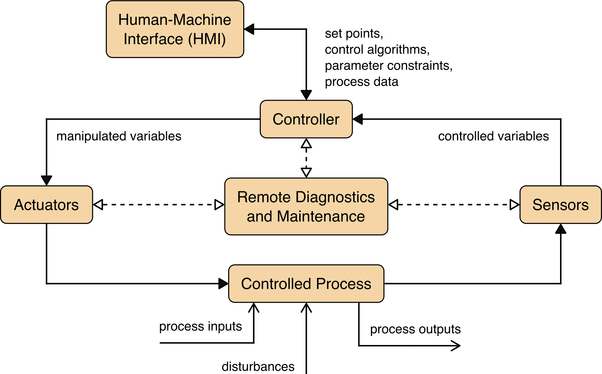
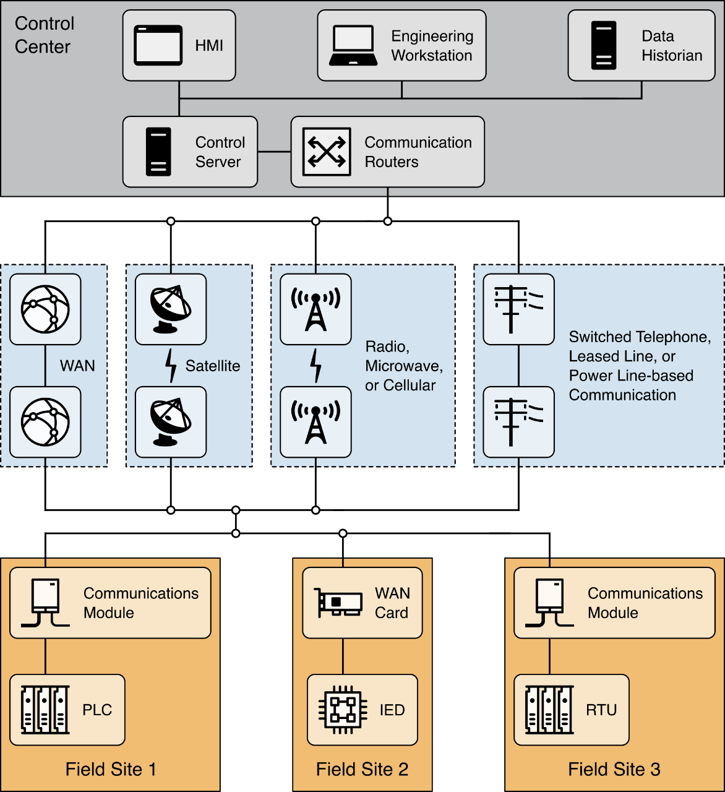
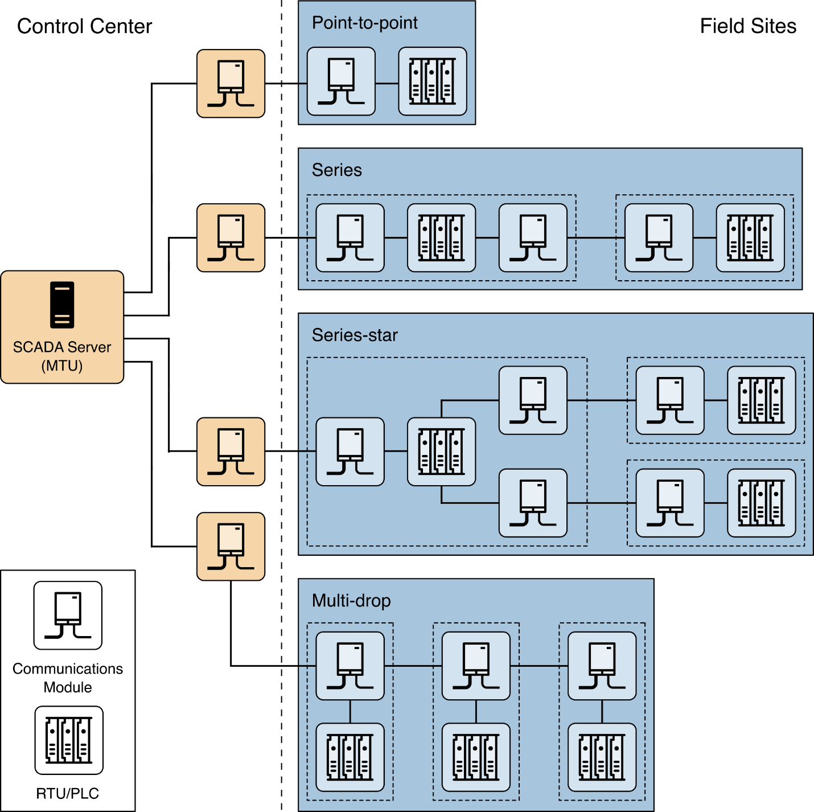
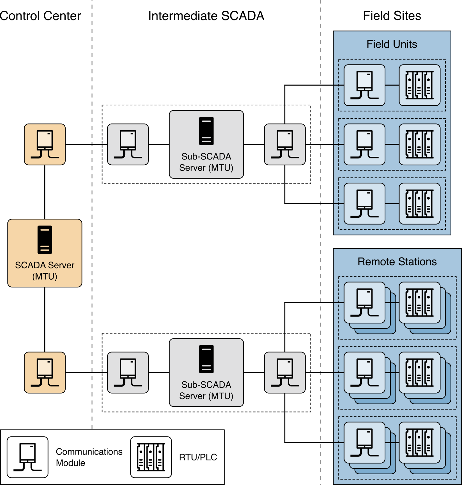
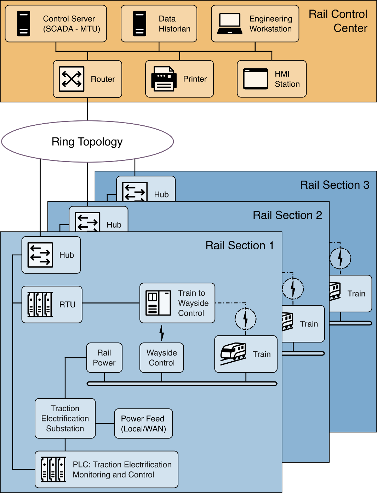
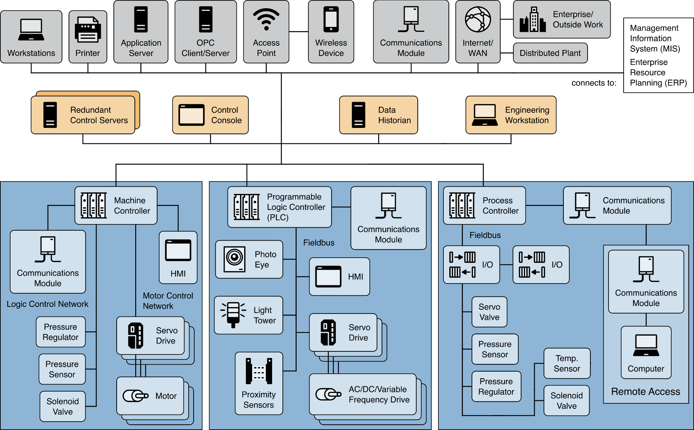
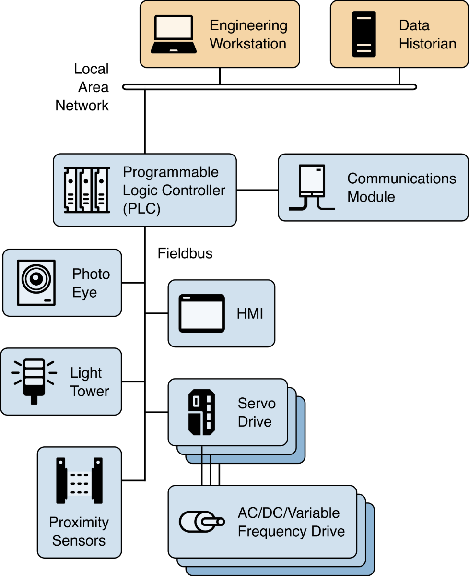
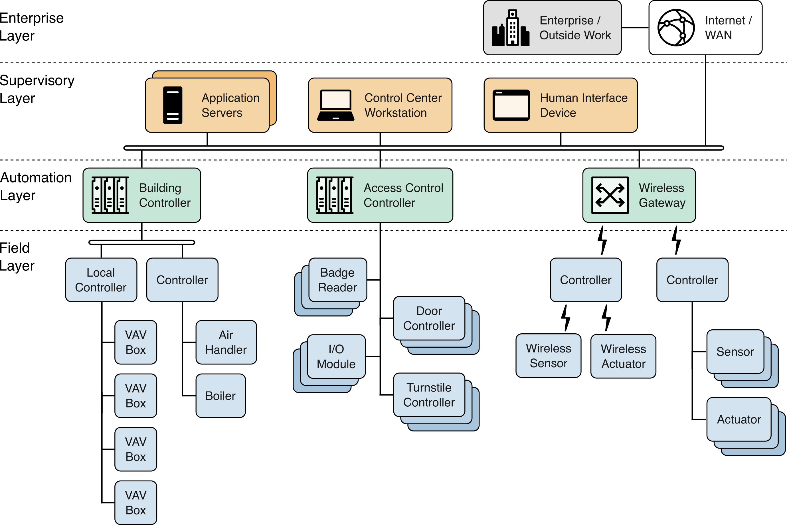
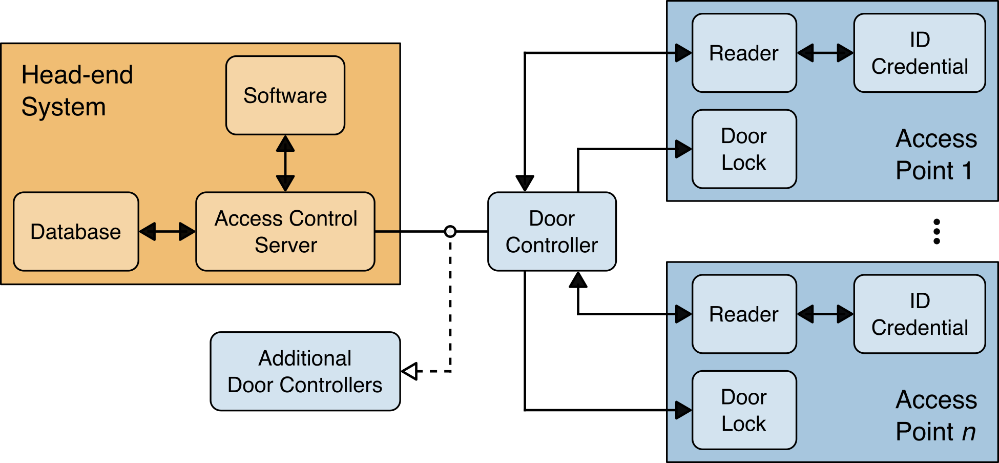
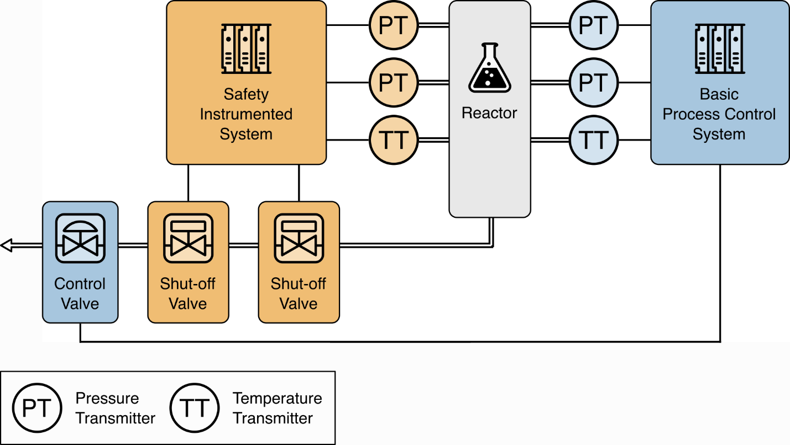

# OT 概述

运营技术（OT）3 涵盖了与物理环境交互（或管理与物理环境交互的设备）的广泛可编程系统和设备。这些系统和设备通过监测和/或控制设备、流程和事件，来检测或引发直接变化。示例包括工业控制系统、楼宇自动化系统、交通系统、物理访问控制系统、物理环境监测系统以及物理环境测量系统等。

> **注**：3：参见 [csrc.nist.org: Operational Technology Security](https://csrc.nist.gov/Projects/operational-technology-security)。

运营技术（OT）系统由多种控制组件（例如电气、机械、液压、气动组件）组合而成，这些组件协同工作以实现特定目标（例如制造、物质或能量的运输）。系统中主要负责产生输出的部分被称为 *过程*。系统中主要负责确保符合规格要求的部分称为 *控制器*（或 *控制部分*）。系统的控制组件包括对期望输出或性能的设定。该系统可通过以下三种方式进行配置：

- *开环，open loop*：输出由预设参数控制；
- *闭环，closed loop*：输出通过影响输入来维持预期的控制目标；
- *手动模式，manual mode*：系统完全由人工控制。

这个部分概述了几种常见的运营技术（OT）系统，包括

- 监督控制与数据采集系统，supervisory control and data acquisition, SCADA、
- 分布式控制系统，distributed control systems, DCS、
- 可编程逻辑控制器，programmable logic controllers，PLCs、
- 楼宇自动化系统，building automation systems，BASs、
- 物理访问控制系统，physical access control systems，PACSs、
- 以及工业物联网，Industrial Internet of Things, IIoT。

图表展示了每种系统类型通常采用的网络拓扑、连接方式、组件及协议。这些示例仅旨在阐明概念性的拓扑概念。此类控制系统的实际部署可能采用混合模式，从而模糊了他们之间的界限。请注意，这个部分中的图表并不侧重于 OT 的安全防护。安全架构和安全控制措施分别在本文件的第 5 部分和附录 F 中进行讨论。

## 运营技术（OT）的演变

当今的运营技术（OT）很大程度上源于将信息技术（IT）能力融入现有物理系统，通常用于替代或补充物理控制机制。例如，嵌入式数字控制系统取代了旋转机械和发动机中的模拟机械控制系统。成本和性能的提升推动了这一演变，并催生了当今许多 “智能” 技术，例如智能电网、智能交通、智能建筑、智能制造以及物联网。虽然这增强了这些系统的互联性并提高了其关键性，但也对系统的适应性、弹性、安全性和安全性提出了更高要求。

OT 工程在保持这些系统典型长生命周期的同时，持续提供新功能。将 IT 能力引入物理系统会产生具有安全影响的新兴行为。工程模型和分析正在不断演进，以应对这些新兴特性，包括安全、安全性、隐私以及环境影响之间的相互依存关系。

## 基于运营技术（OT）的系统及其相互依赖关系

运营技术（OT）被广泛应用于众多行业和基础设施中，包括美国网络安全与基础设施安全局（CISA）确定为以下列出的 [关键基础设施部门](https://www.cisa.gov/topics/critical-infrastructure-security-and-resilience/critical-infrastructure-sectors) 的行业和领域。运营技术（OT）存在于所有关键基础设施中，在加粗标注的领域中更为普遍。

- **化工部门**；
- **商业设施部门**；
- 通信部门；
- **关键制造部门**；
- **水坝部门**；
- **国防工业基础部门**；
- **应急服务部门**；
- **能源部门**；
- 金融服务部门；
- **食品与农业部门**；
- **政府设施部门**；
- **医疗保健与公共卫生部门**；
- 信息技术部门；
- **核反应堆、核材料及核废料处理部门**；
- **交通运输系统部门**；
- **供水与污水处理系统部门**。

OT 对美国关键基础设施的运行至关重要，这些基础设施通常是高度互联且相互依赖的系统，既通过物理层面，也通过多种信息和通信技术实现。需要注意的是，虽然联邦机构运营上述许多关键基础设施，但许多其他基础设施是私人拥有和运营的。此外，关键基础设施常被称为 “系统中的系统”，因为各工业部门之间存在相互依赖关系，以及商业伙伴之间的相互联系 [Peerenboom](./refs.md#peerenboom)[Rinaldi](./refs.md#rinaldi)。一个基础设施中的事件可能通过连锁和升级的故障，直接或间接影响其他基础设施。

例如，电力输电和配电网行业都使用地理分布式的 SCADA 控制技术，运营高度互联且动态的系统，这些系统由数千家公私公用事业及农村合作社组成，为终端用户供电。一些 SCADA 系统通过从地理位置偏远的现场控制站收集数据并向集中地点下达指令，来监控和控制电力分配。SCADA 系统还用于监测和控制水、石油和天然气的分配，包括管道、船舶、卡车、铁路系统和污水收集系统。

SCADA 系统和 DCS 通常通过网络相互连接。电力控制中心和发电设施便是如此。尽管发电设施的运行由 DCS 控制，但 DCS 必须与 SCADA 系统进行通信，以协调发电量与输配电需求。电力通常被视为导致相互依存的关键基础设施中断的最常见原因之一。例如，用于电力传输 SCADA 系统的微波通信网络一旦中断，就可能引发连锁故障。监控与控制能力的缺失，可能导致大型发电机组离线，进而引发输电变电站的电力中断。这种中断可能造成重大电力失衡，触发电网范围内的连锁故障，导致大面积停电，进而可能影响依赖电网供电的石油和天然气生产、炼油厂运营、水处理系统、污水收集系统以及管道运输系统。

## OT 系统的运行、架构与组件

如 [图 1](#f-1) 所示，典型的 OT 系统包含众多控制回路、人机界面以及远程诊断和维护工具。系统基于分层网络架构，采用多种网络协议构建。某些关键流程还可能包含安全系统。

*控制回路* 利用

- 传感器、
- 执行器
- 和控制器

来调节受控过程。*传感器* 属于一种能够测量某些物理属性，并将该信息作为 *受控变量* 发送给控制器的设备；控制器对测量值进行解析，并根据控制算法和目标设定点，生成相应的 *操纵变量*，随后将其传输至执行器。*执行器* -- 比如控制阀、断路器、开关和电机等，则根据控制器的指令，直接对受控过程进行调节。

**图 1**：典型 OT 系统的基本操作

在典型的监控系统中，传感器与执行器之间通常没有直接连接。传感器数值会被传输到监控站，由人工进行分析。然而，此类系统仍可被视为运营技术（OT）系统（尽管涉及人工干预），因为监控系统的目标通常是识别并最终缓解某种事件或状况（例如：门被强行打开时触发警报，导致安保人员被派去调查；服务器机房的环境传感器检测到高温，导致控制中心人员启动辅助空调机组）。

操作员和工程师使用 *人机界面（HMI）* 来监控和配置设定点、控制算法，以及调整和设定控制器中的参数。HMI 还会显示过程状态信息和历史信息。*诊断和维护工具* 用于预防、识别异常运行或故障，并进行恢复。

有时，控制回路呈嵌套和/或级联结构，其中一个回路的设定值由另一回路确定的过程变量决定。监督级回路和下级回路在整个过程期间持续运行，其循环时间范围从毫秒级到分钟级不等。

### OT 系统设计考量因素

OT 系统的设计取决于许多因素，包括是否采用基于 SCADA、DCS 或 PLC 的拓扑结构。这一小节阐述了推动 OT 系统设计在控制、通信、可靠性和冗余特性方面的关键因素。由于这些因素对 OT 系统的设计影响重大，因此他们也有助于确定系统的安全需求。

- **安全性**。系统必须能够检测到不安全状况，并触发相应措施，将不安全状况转化为安全状态。在大多数安全关键型操作中，人类对潜在危险过程的监督和控制至关重要;
- **控制时序要求**。系统过程涉及广泛的时间相关要求，包括极高的速度、一致性、规律性和同步性。人类可能无法可靠且一致地满足这些要求，因此可能需要自动化控制器。某些系统可能要求计算尽可能在传感器和执行器附近进行，以减少通信延迟并及时执行必要的控制动作;
- **地理分布**。系统的分布程度各不相同，范围从小型系统（例如本地 PLC 控制的工艺）到大型分布式系统（例如输油管道、电力电网）。分布范围越广，通常意味着需要广域网（例如专线、电路交换、分组交换）和移动通信;
- **层次结构**。监督控制，supervisory control，用于建立一个中央节点，该节点可汇总来自多个位置的数据，从而根据系统的当前状态支持控制决策。通常采用分层或集中式控制，以便为人工操作员提供整个系统的全面视图；
- **控制复杂性**。简单的控制器和预设算法通常能够执行控制功能。然而，对于更复杂的系统（例如空中交通管制），则需要人工操作员确保所有控制措施都符合系统的大目标；
- **可用性**。对可用性和运行时间要求较高的系统，可能需要在所有通信和控制环节中增加冗余或采用备用方案；
- **故障影响**。控制功能的故障可能在不同领域引发截然不同的影响。影响范围较大的系统通常需要具备通过冗余控制继续运行或在降级状态下运行的能力。

### SCADA 系统

监督控制与数据采集，supervisory control and data acquisition, SCADA 系统用于控制分散的资产，对于此类资产而言，集中式数据采集与控制同样重要 [Bailey](./refs.md#bailey) [Boyer](./refs.md#boyer)。这些系统广泛应用于各类输配系统，例如供水和污水收集系统、石油和天然气管道、电力输配电系统，以及铁路和其他公共交通系统。SCADA 系统集成了

- 数据采集系统、
- 数据传输系统，
- 以及人机界面（HMI）软件

为众多过程输入和输出提供集中式监控系统。SCADA 系统旨在采集现场信息，将其传输至控制中心，并以图形或文本形式向操作员展示，从而使操作员能够从中央位置近乎实时地监控或控制整个系统。根据具体系统的复杂程度和配置，对任何单个系统、操作或任务的控制既可以是自动的，也可以通过操作员指令来执行。

典型的硬件包括位于控制中心的控制服务器、通信设备（例如无线电、电话线、电缆或卫星），以及一个或多个地理上分散的现场站点，这些站点由远程终端单元，remote terminal units, RTUs 和/或可编程逻辑控制器（PLC）组成，用于控制执行器和/或监控传感器。控制服务器负责存储和处理来自 RTU 输入和输出的信息，而 RTU 或 PLC 则控制本地过程。通信硬件用于在控制服务器与 RTU 或 PLC 之间传输信息和数据。软件通过编程告知系统应监控哪些内容及何时监控，哪些参数范围是可接受的，以及当过程变量超出可接受值范围时应采取何种响应措施。智能电子设备，intelligence electronic device, IED，例如保护继电器，可直接与控制服务器通信；或者，本地 RTU 可轮询 IED 以收集数据并将其传递给控制服务器。IED 为控制和监控设备及传感器提供了直接接口。IED 可由控制服务器直接轮询和控制，并且在大多数情况下，IED 具有本地编程功能，使其无需控制中心的直接指令即可独立运行。SCADA 系统通常被设计为具有显著冗余的容错系统，尽管面对恶意攻击时，冗余可能并非充分的应对措施。

[图 2](#f-2) 展示了 SCADA 系统的组成部分及其总体架构。图中顶部的控制中心内设有控制服务器和通信路由器。控制中心的其他组件包括人机界面（HMI）、工程工作站和数据历史库，他们均通过局域网（LAN）相互连接。控制中心负责收集并记录现场站点采集的信息，将信息显示在人机界面上，并可根据检测到的事件生成相应操作。控制中心还负责集中报警、趋势分析和报告生成。

图 2 底部的现场站点负责本地控制执行器并监控传感器。现场站点通常配备远程访问功能，以便操作员进行远程诊断和维修，通常通过独立的拨号调制解调器或广域网（WAN）连接实现。控制中心与现场站点之间采用基于串行和网络通信的标准及专有通信协议，利用遥测技术，如电话线、电缆、光纤和无线电频率，例如广播、微波、卫星等传输信息。

**图 2**：一个展示控制中心设备、通信设备和现场站点的 SCADA 系统总体布局图

SCADA 通信拓扑在不同实现中各不相同。下图 3 展示了所采用的各种拓扑结构，包括

- 点对点、
- 串联、
- 串联-星型、
- 和多点连接

[AGA12](./refs.md#aga12)

点对点拓扑在功能上最为简单，但由于每条连接都需要单独的信道，因此成本可能较高。在串联配置中，虽然使用的信道数量减少了，但信道共享会影响 SCADA 操作的效率和复杂度。同样，串联-星型和多点接入配置因每个设备占用一个信道，导致效率降低且系统复杂度增加。

图 3 中所示的四种基本 SCADA 拓扑结构，可通过使用专用设备来管理通信交换并执行消息交换和缓冲来进一步增强。

**图 3**：点对点、串行、串行-星型和多点接入 SCADA 通信拓扑的示例

包含数百个远程终端单元（RTU）的大型 SCADA 系统，通常会采用辅助控制服务器来减轻主服务器的负担。此类拓扑结构如下图 4 中所示。

**图 4**：一个支持大量远程站点的 SCADA 拓扑示例

下图 5 展示了一个 SCADA 系统的实施示例，该系统由一个主控制中心和三个现场站点组成。第二个备用控制中心可在主控制中心发生故障时提供冗余保障。控制中心与现场站点之间的所有通信均采用点对点连接，其中两条连接使用无线电遥测技术。第三个现场站点位于控制中心附近，通过广域网（WAN）进行通信。区域控制中心位于主控制中心之上，以实现更高级别的监督控制。企业网络可通过广域网访问所有控制中心，并可远程访问现场站点以进行故障排除和维护操作。主控制中心以预定义的间隔（例如 5 秒、60 秒）轮询现场设备以获取数据，并可根据需要向现场设备发送新的设定值。除了轮询和发出高级命令外，控制服务器还会监听来自现场报警系统的优先级中断。

**图 5**：一个全面的 SCADA 系统实施案例

下图 6 展示了一个轨道监测与控制的实施示例。该示例包含一个配备 SCADA 系统的轨道控制中心以及三段轨道系统。SCADA 系统会轮询各轨道段以获取信息，例如列车状态、信号系统、牵引电气化系统以及自动售票机的状态。这些信息也会传输至轨道控制中心内 HMI 站点的操作员控制台。SCADA 系统监控铁路控制中心操作员的输入，并将高级操作指令分发至各铁路区段的组件。此外，SCADA 系统还会监控各铁路区段的运行状况，并根据这些状况发出指令（例如，停车以防止列车驶入被洪水淹没或已被另一列火车占用的区域）。

**图 6**：铁路监测与控制 SCADA 系统实施案例

### 分布式控制系统

分布式控制系统，distributed control systems, DCS 用于控制同一地理区域内的生产系统，主要应用于炼油、水处理与污水处理、发电、化工制造、汽车生产以及制药加工等行业。这些系统通常属于工艺控制系统或离散部件控制系统。

DCS 作为一种控制架构进行集成，包含一个监督控制层，用于管理多个负责控制局部工艺细节的集成子系统。DCS 利用集中式监督控制回路，来协调一组本地控制器，这些控制器共同承担执行整个生产过程的总体任务 [Erickson](./refs.md#erickson)。产品和工艺控制通常通过部署反馈或前馈控制回路来实现，从而自动将关键的产品和/或工艺条件，维持在期望的设定点附近。现场采用特定的工艺控制器或功能更强大的 PLC，并对其进行调校，以在工艺异常期间提供所需的容差和自修正速率。通过将生产系统模组化，DCS 降低了单个故障对整个系统的影响。在许多现代系统中，DCS 与企业网络相连，以便业务运营部门能够掌握生产情况。

下图 7 展示了一个 DCS 的组件实现示例及其总体配置。该 DCS 覆盖了整个设施，从底层的生产过程一直延伸到企业管理层。在此示例中，监督控制器（控制服务器）通过控制网络，与其下级设备进行通信。监督控制器向分布式现场控制器发送设定值，并从其处请求数据。分布式控制器根据控制服务器的命令以及来自过程传感器的反馈，控制其过程执行器。

图 7 还列举了 DCS 系统中常见的底层控制器示例。图中所示的现场控制设备包括机器控制器、PLC 和工艺控制器。机器控制器通过点对点布线与传感器和执行器连接，而其余三种现场设备则采用现场总线网络，fieldbus networks，与工艺传感器和执行器进行通信。现场总线网络消除了控制器与各个现场传感器及执行器之间点对点布线的需求。此外，现场总线不仅具备控制功能，还支持现场设备诊断等更多功能，并可在总线内部执行控制算法，从而避免每次控制操作时都需要将信号路由回 PLC。Modbus 和 Fieldbus 等行业组织设计的标准工业通信协议，常被应用于控制网络和现场总线网络中 [Berge](./refs.md#berge)。

除了监督级和现场级控制回路外，还可能存在中间级控制。例如，在分布式控制系统（DCS）控制离散零件制造工厂的情况下，工厂内的每个单元都可能设有中间级监督器。该监督器涵盖一个制造单元，该单元包含一个处理零件的机器控制器和一个处理原材料及成品的机器人控制器。在主 DCS 监督控制回路下，可能存在多个此类单元来管理现场级控制器。

**图 7**：一个全面的 DCS 实施案例

### 基于可编程逻辑控制器（PLC）的拓扑结构

如前几个小节所述，PLC 既用于 SCADA 系统，也用于 DCS 系统，作为整体分层系统的控制组件，通过反馈控制对工艺进行本地管理。在 SCADA 系统中，PLC 可能提供与远程终端单元（RTU）类似的功能。在 DCS 系统中，PLC 作为监督控制架构内的本地控制器进行部署。

在较小的 OT 系统配置中，PLC 也可作为主控制器，对离散过程（如汽车装配线、工艺控制器）进行操作控制。这些拓扑结构与 SCADA 和 DCS 的区别在于，他们通常没有中央控制服务器或 HMI，因此主要提供闭环控制，且人工干预极少。PLC 配备用户可编程存储器，用于存储指令以实现特定功能，例如

- I/O 控制、
- 逻辑运算、
- 定时、
- 计数、
- 三模式的比例-积分-微分，propotion-integral-derivative, PID 控制、
- 通信、
- 算术运算、
- 以及数据和文件处理等。

下图 8 展示了一个通过现场总线网络执行制造工艺控制的 PLC。可通过工程工作站上的编程接口访问该 PLC，数据存储在数据历史数据库中，所有这些设备均通过局域网（LAN）连接。

**图 8**：PLC 控制系统实施示例

### 楼宇自动化系统

楼宇自动化系统，building automation system, BAS 是一种运营技术（OT），用于控制建筑物中使用的多种系统，包括

- 供暖、通风和空调，heating, ventilation, and air conditioning, HVAC、
- 消防，fire、
- 电气, electrical、
- 照明, lighting、
- 物理门禁控制, physical access control、
- 物理安防, physical security、
- 以及其他公用设施系统。

大多数现代建筑在建造时都配备了某种形式的楼宇自动化系统。然而，老旧建筑和设备可能需要进行改造，才能充分利用楼宇自动化系统带来的优势。BAS 的一些最常见功能包括：

- 维持环境条件以确保使用者舒适度、
- 降低能耗、
- 减少运营和维护成本、
- 增强安全性、
- 记录历史数据（例如温度、湿度），
- 以及执行常规设备监控（例如向建筑人员发出设备故障或报警状态的警报）。

下图 9 展示了一个 BAS 的示例。BAS 可通过有线或无线路径与控制器或网关进行通信。例如，环境控制传感器可向楼宇控制器提供温度和湿度数据。当传感器读数超出设定值范围时，控制器可向变风量，variable aire volume, VAV 箱发出信号，以增加或减少风量，从而将温度调节至目标状态。同样地，当建筑使用者在读卡器上刷卡时，其身份凭证会被发送至门禁控制器和应用控制服务器，以确定是否应授予访问权限。虽然本指南包含适用于保护楼宇自动化系统（BAS）免受网络安全威胁的建议，并可作为参考，但建议读者对自身系统进行基于风险的评估，并根据具体的安全、业务和运营需求，对推荐的指南和解决方案进行调整。

**图 9**：BAS 实现示例

### 物理门禁控制系统

物理门禁控制系统, physical access control system, PACS 是一种旨在控制特定区域出入的物理安防系统。与标准的物理屏障不同，物理门禁控制能够控制

- 谁被授予通行权限、
- 何时授予通行权限、
- 以及通行权限的有效时长。

出入口是指需要实施门禁控制的入口或屏障。常见的物理门禁控制访问点包括

- 门和锁、
- 安检门、
- 旋转闸机、
- 以及车辆闸臂。

根据设施类型的不同，可能只有一个访问点（例如高安全区域），也可能有多个（例如大型办公楼）。

身份凭证（ID）或个人凭证用于识别试图进入特定区域或设施的授权用户。PACS 系统通常要求用户持有凭证才能进入设施或访问敏感数据。身份凭证的示例包括

- 简单控制方式（例如：个人识别码、密码、钥匙扣、门禁卡）；
- 以及更先进的凭证（例如：加密徽章、移动凭证）。

身份凭证使系统能够识别试图进入的人员并维护访问日志。

读卡器和/或键盘通常位于访问点。读卡器读取数据并将其发送至门控控制器，以验证凭证并决定是否应授权访问。如果还需使用键盘或生物识别读卡器（即用于多因素认证, multi-factor authentication），用户将在凭证扫描后输入个人识别码（PIN），或进行生物特征扫描。下图 10 展示了一个 PACS 的示例。

**图 10**：PACS 实施示例

在此示例中，门控控制器从读卡器接收凭证数据并验证身份凭证。如果凭证获得门禁服务器的批准，控制面板将发送命令以授权通行并解锁门。如果凭证被拒绝，门将保持锁定状态，用户将无法进入。所有访问尝试都会由门控制器记录，并最终由门禁服务器记录。门禁服务器是用户信息、访问权限和审计日志的存储库。根据系统的不同，服务器可能部署在本地，也可能在云端进行管理。

虽然本指南包含适用于保护 PACS 免受网络安全威胁的建议，并可作为参考，但建议读者对自身系统进行基于风险的评估，并根据具体的安全、业务和运营需求，对推荐的指南和解决方案进行调整。

### 安全系统

运营技术（OT）系统所控制的许多物理过程，都可能对人的生命安全、财产及环境造成危害。安全系统，safety systems 的设计旨在通过将系统置于安全状态，从而降低这些潜在危险情况发生的概率和/或减轻其后果。与 OT 环境相关的安全系统主要有几种类型，包括

- 紧急停机, emergence shut down, ESD、
- 工艺安全停机, process safety shutdown, PSS、
- 以及火灾和气体系统，fire and gas systems, FGS。

较为知名的安全系统类型之一属于安全仪表系统, safety instrumented system, SIS，他由一个或多个安全仪表功能，safety instrumented functions, SIF 组成。所谓安全仪表功能（SIF），属于一种工程系统，通常由传感器、逻辑解算器和最终控制元件（如执行器）构成，其目的是在预定阈值被突破时，将系统置于安全状态。SIS 作为整体风险降低策略的一部分，旨在降低已识别事件的发生概率和/或潜在后果，使其控制在组织的风险容忍范围内。尽管与安全系统相关的术语众多，但 SIS 是根据 [IEC61511](./refs.md#iec61511) 标准专门设计的。SIS 通常应用于化工、炼油和核能工艺中。

安全仪表系统（SIS）通常与其他所有控制系统相互独立，以确保基本工艺控制系统，the basic process control system, BPCS 的故障，不会对 SIS 的功能造成不利影响。从历史上看，SIS 的设计是作为独立系统存在的，在物理和逻辑上与其他控制系统分离，并与之保持物理隔离。如下图 11 所示的配置中，SIS 和 BPCS 完全独立运行，系统之间没有直接通信。然而，一些现代 SIS 的设计允许与控制系统进行通信。这类 SIS 被称为集成控制与安全系统，Integrated Control and Safety Systems, ICSSs。ICSS 解决方案可以是来自单一供应商的一体化设备，也可以整合来自多家供应商的多种设备。

尽管 ICSS 结合了控制系统和安全系统的功能，但 SIS 仍必须符合 [IEC61511](./refs.md#iec61511) 中规定的要求。这种 ICSS 方法论的一大优势在于，能够将信息从 SIS 传输至 BPCS。虽然本指南包含适用于保护安全系统免受网络安全威胁的建议，并可作为参考，但建议读者对其系统进行基于风险的评估，并根据具体的安全、业务和运营要求，对推荐的指南和解决方案进行定制。

**图 11**：SIS 的实施示例
