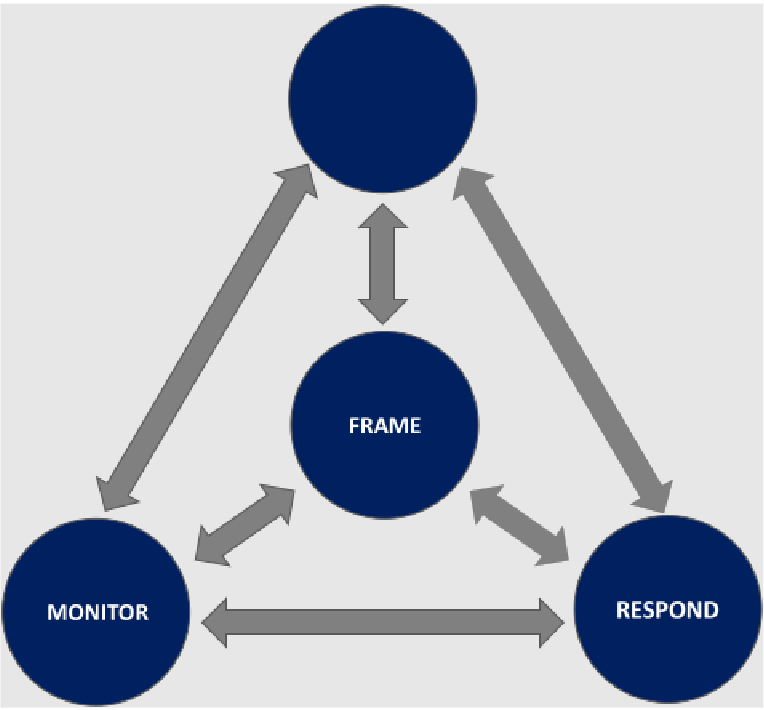
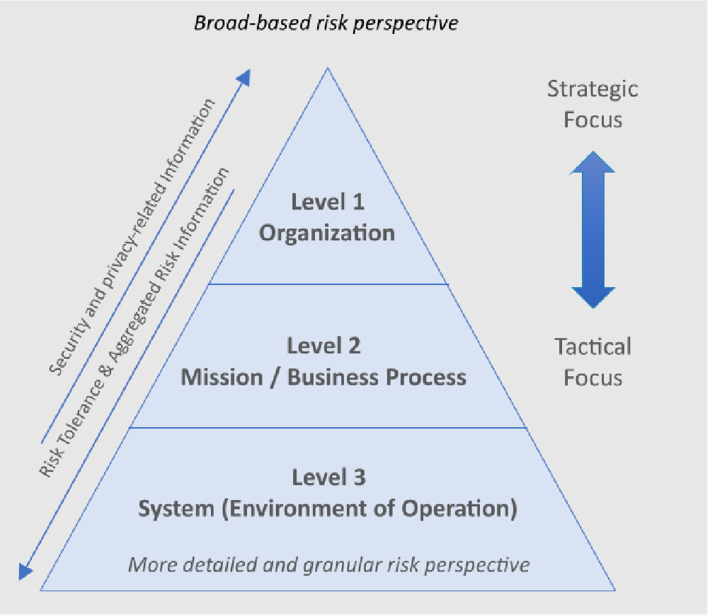

# OT 系统的风险管理

组织在实现其业务目标时每天都会管理风险，包括财务损失、设备故障和人员安全。组织开发流程来评估与其业务相关的风险，并根据

- 组织优先级、
- 风险承受能力、
- 以及内部和外部约束

来决定如何管理这些风险。这种风险管理是一个交互式持续过程，是正常运营的一部分。使用 OT 系统的组织，历来通过安全和工程方面的良好实践来管理风险。大多数行业都已建立了安全评估体系，并且经常纳入监管要求中。信息安全风险管理是一个可以补充的附加维度。这个部分概述的风险管理流程和框架，可应用于管理安全、信息安全和网络供应链风险。对于某些 OT 系统来说，隐私也是一个风险考虑因素。有关隐私风险管理的其他指南，请参阅 NIST 风险管理框架，Risk Management Framework [[SP800-37r2](./refs.md#sp800-37r2)] 和 隐私框架, Privacy Framework [[PF](./refs.md#pf)]。

使用三级方法在整个组织中部署风险管理流程，以解决

- (i) 组织级、
- (ii) 任务和业务流程级、
- 以及 (iii) 系统级（即 IT 和 OT）的风险。

风险管理流程在三个层面上无缝实施，总体目标是持续改进组织的风险相关活动，并在所有对组织的成功有共同利益的利益相关者之间，进行有效的层间和层内沟通。

这个部分主要关注系统级别的 OT 系统注意事项，尽管每个级别的风险管理活动、信息和构件都会影响并通知其他级别。[第 6 部分](./cybersecurity_framework.md) 将网络安全框架应用于 OT 系统，而 [附录 F](./appendix-f.md) 提供了特定于 OT 的建议，以增强 NIST SP 800-53，修订 5 [[SP800-53r5](./refs.md#sp800-53r5)] 控制系列。这个部分还讨论 OT 系统注意事项，以及这些注意事项对风险管理流程的影响。

有关多层风险管理与风险管理流程的更多信息，请参阅

- NIST SP 800-39，*管理信息安全风险：组织、任务和信息系统视图* [ [SP800-39](./refs.md#sp800-39)]；
- NIST SP 800-37，修订 2，*信息系统和组织的风险管理框架：安全和隐私的系统生命周期方法* [ [SP800-37r2](./refs.md#sp800-37r2)]，提供了将风险管理框架应用于联邦信息系统的指南，包括开展安全分类活动，5安全控制选择与实施、安全控制评估、信息系统授权 6；
+ NIST SP 800-30，*进行风险评估指南* [ [SP800-30r1](./refs.md#sp800-30r1)]，为组织提供了关于如何
    - (i) 准备风险评估、
    - (ii) 进行风险评估、
    - (iii) 将风险评估结果传达给关键组织人员、
    - 以及 (iv) 随着时间的推移维护风险评估的分步流程。

> *注*：
>
> 5 联邦信息处理标准, Federal Information Processing Standard, FIPS 199 [ [FIPS199](./refs.md#fips199)] 为非国家安全系统提供了安全分类指南。国家安全系统委员会 (CNSS) 第 1253 号指令为国家安全系统提供了类似的指导。
>
> 6 安全授权是由高级组织官员做出的正式管理决策，授权信息系统的运行，并根据商定的一组安全控制的实施，明确接受组织运行和资产、个人、其他组织和国家的风险。

## 管理 OT 安全风险

虽然 NIST SP 800-39 [ [SP800-39](./refs.md#sp800-39)] 中提出的风险管理流程适用于所有类型的系统，但在管理 OT 系统安全风险时，需要考虑一些独特的方面。如下 [图 13](#f-13) 中所示，风险管理流程有四个组成部分：

- 构建风险框架（即为基于风险的决策建立背景）、
- 评估风险、
- 应对风险、
- 和监控风险。

这些活动是相互依赖的，并且通常在组织内同时发生。例如，监控组件的结果将输入到框架组件中。由于组织运作的环境总是在变化，因此风险管理必须是一个连续的过程，其中所有组成部分都会不断地活动。重要的是要记住，这些组件适用于任何类型风险的管理，包括

- 网络安全、
- 物理安全、
- 安全、
- 和财务。

第 4.1.1 小节到 4.1.4 小节更详细地讨论了风险管理流程的四个组成部分，并提供了特定于 OT 的实施指南。

**图 13**：风险管理流程：框架、评估、响应与监控

如下图 14 所示，组织范围的风险管理应用于三个层面。第 1 级从组织角度解决风险管理问题，并通过为组织内的所有风险管理活动提供背景来实施风险框架。 2 级从任务和业务流程的角度解决风险，并接受 1 级的风险背景、决策和活动等的通告。第 3 级解决系统级别的风险，并由第 1 级和第 2 级的活动和输出通知。

**图 14**：风险管理层级：组织、使命与业务流程及系统

每个风险管理组件（即框架、评估、响应和监控）一起应用于整个风险管理级别，从而提高整个组织的风险意识以及基于风险的决策的可追溯性和透明度。

### 建立 OT 风险框架

框架组件由建立所需假设、约束、风险承受能力和风险管理策略的流程组成，以便组织做出一致的风险管理决策。具体而言，风险框架通过整合组织治理结构、法律/监管环境和其他因素的要素，来支持总体风险管理策略，以确定组织打算如何评估、响应和监控所有 IT 和 OT 系统的风险。

> **特定于 OT 的建议和指南**
>
> 对于 OT 系统操作员来说，安全直接影响如何决策系统的设计和运行。安全可以定义为 “免受可能导致死亡、受伤、职业病、设备或财产损坏或损失或环境破坏的情况的影响。freedom from conditions that can cause death, injury, occupational illness, damage to or loss of equipment or property, or damage to the environment.” 7 基于此，人类安全影响通常是根据因网络事件后 OT 系统发生故障可能造成的伤害、疾病或死亡的程度进行评估，采取考虑之前进行的任何关于员工和公众的安全影响评估。安全和发展安全文化的重要性，在确定风险承受方面发挥着关键作用。
>
> **注**：7 请参阅 https://csrc.nist.gov/glossary/term/safety
>
> 组织应考虑纳入对 OT 系统的网络安全影响的分析，即影响人员安全和环境，以及缓解控制措施。更具体地说，组织可能希望考虑采用全面的流程，来系统地预测或识别每个安全关键故障的操作行为，可能导致危险或危险的情况、故障情况或人为错误潜在的人类危害。
>
> 组织可能还会考虑遗留系统的影响及其环境中的组件。具体来说，遗留系统可能无法充分支持网络安全，以防范风险超过组织的容忍水平。
>
> OT 系统运营者的另一个主要关注点是，OT 系统提供的服务的可用性。OT 系统可能是关键基础设施（例如供水或电力系统）的一部分，其中非常需要连续可靠的运营。因此，OT 系统可能对可用性或恢复有严格的要求。组织应了解并规划实现其操作环境所需的弹性所需的冗余级别，并将这些要求纳入其风险框架中。这将帮助组织做出风险决策，避免对依赖所提供服务的人，造成意想不到的后果。更具体地说，组织应考虑识别相互依赖的 OT 系统，这些系统会带来威胁系统可用性的网络安全风险。
>
> 此外，组织应考虑事件如何传播到连接的系统和系统组件。OT 可以与其他系统互连，这样一个系统或流程中的故障，就很容易级联到组织内部或外部的其他系统。由于物理和逻辑的依赖性，可能会发生影响传播。将风险评估结果正确传达给互联或相互依赖的系统和流程的运营者，是管理此类影响的一种方法。
>
> 当网络事件传播到互联的 OT 系统时，则可能会对互联的 OT 造成逻辑损坏。例如，病毒或蠕虫可能会传播到连接的 OT 并影响该系统。物理损坏还可能传播到其他互连的 OT 或相关物理域。例如，影响可能会导致物理危害，从而降低附近物理环境或共同共享依赖性（例如电源）的质量，或者导致工业过程后期所需的材料短缺。

网络安全与基础设施安全局，cybersecurity and infrastructure security agency, CISA 促进政府和行业之间的共同努力，以提高他们预测、确定优先级，和管理国家级 OT 风险的能力。 CISA 协助所有关键基础设施领域的 OT 系统供应商和资产所有者、运营者和其他供应商识别安全漏洞，并制定合理、主动的缓解策略，以加强其 OT 系统的网络安全态势。

> **特定于 OT 的建议和指导**
>
> 组织可能需要考虑将 NIST 的 [国家漏洞数据库，National Vulnerability Database, NVD](https://nvd.nist.gov/) 和 MITRE 的 [工业控制系统，Industrial Control Systems，ICS 框架 ATT&CK](https://attack.mitre.org/techniques/ics/) [ [ATTACK-ICS](./refs.md#attack-ics)] 等资源，纳入其评估任务和 OT 系统风险流程中。此外，OT 系统的性质要求组织考虑在对传统 IT 系统进行风险评估时，可能不存在的其他因素。例如，OT 将具有与 IT 不同的威胁源、漏洞和补偿控制。 OT 环境中网络事件的影响，可能包括风险评估需要纳入的物理和数字影响，包括：
>
> - 对安全和安全评估使用的影响；
> - 网络事件对 OT 的物理影响，包括更大的物理环境，以及对受控过程的影响；
> - OT 内非数字控制组件风险评估的后果。

在搭建风险框架期间，组织应选择适当的风险评估方法，其中包括 OT。在评估网络事件造成的潜在物理损害时，拥有 OT 系统的组织可以考虑

- i) 网络事件如何操纵操作来影响物理环境；
- ii) OT 系统中存在哪些设计功能来防止或减轻影响；
- 以及 iii) 根据这些条件如何可能出现物理事件。

> **特定于 OT 的建议和指南**
>
> 在 OT 环境中搭建风险框架时，组织可能会发现网络安全威胁并不总是像 OT 危害那样易于理解或预测。组织可以考虑将网络攻击和 IT 故障场景，纳入其流程危害分析，process hazard analysis, PHA 或故障模式和影响分析，failure mode and effects analysis, FMEA 流程中。通过将网络攻击带来的风险，和网络风险管理措施纳入这些流程，组织可以更好地了解 OT 运营环境的网络风险。作为风险框架的一部分，组织可能还需要考虑：
>
> - 关于如何在整个组织内评估、响应和监控风险的假设；
> - 组织的风险承受能力，即可以承受的风险水平被接受为实现战略目标的一部分，以及作为管理一部分考虑的优先事项和权衡风险。
>
> 在 OT 背景下，对设备、人员安全、自然环境和其他关键基础设施造成损害的可能性，是这些考虑因素的一部分。组织可能需要考虑评估 OT 系统所有部分的潜在物理影响。组织可能还需要确定 OT 系统如何交互，或依赖 IT 来支持风险框架。这些流程可能要求组织确定一个通用框架，来评估包含 OT 考虑因素的影响。一种方法基于 NIST FIPS 199 [ [FIPS199](./refs.md#fips199) ]，该标准规定根据机密性、完整性和可用性的安全目标，将系统分为低影响、中度影响或高影响。另一种基于 ISA 62443-3-2 [ [ISA62443](./refs.md#isa62443) ] 的方法，提供了利用 OT 影响确定系统分类的示例定义。

下 [表 3](#t-3) 提供了组织可以自定义以满足其特定行业，或业务要求的可能示例类别和影响级别。例如，某些组织可能会将持续一天的中断，视为具有较高影响而不是中等影响，如表中所示。

**表 3**：根据生产的产品、行业和安全问题，对 OT 影响级别的可能定义

| 类别 | 高影响 | 中影响 | 低影响 |
| :- | :- | :- | :- |
| 多个站点停电 | 多个站点的运营受到严重干扰，预计需要 1 天或多天的时间恢复 | 多个站点的运营受到部分干扰，预计需要 1 小时以上的时间才能恢复  | 多个站点的运营部分中断，但需要不到 1 小时的时间才能恢复到全部功能 |
| 国家基础设施和服务 | 影响多个部门或严重扰乱社区服务 | 有可能对公司以外的部门产生影响 | 对单个公司以外的部门几乎没有影响，对社区几乎没有影响 |
| 代价（占收入的百分比） | <code>> 25%</code>  | <code>> 5%</code>  | <code>< 5%</code> |
| 法律问题 | 重罪或影响经营许可证的合规违规行为 | 轻罪刑事犯罪或导致罚款的合规违规行为 | 无 |
| 公众信心 | 品牌形象损失 | 客户信心丧失 | 无 |
| 现场人员 | 死亡 | 工作日损失或重大伤害 | 急救或可记录伤害 |
| 不在现场人员 | 死亡或重大社区事件 | 投诉或当地社区影响 | 无投诉 |
| 环境 | 受到地区机构的处罚或大面积长期重大损害 | 受到当地机构的处罚 | 小规模、封闭性排放低于可报告限度 |

为了支持风险评估流程，组织还应定义如何确定网络安全事件发生的可能性，以在评估风险时保持一致性。NIST SP 800-30，修订 1 [ [SP800-30r1](./refs.md#sp800-30r1) ] 为组织制定可能性加权风险因素提供指导。组织应根据对

- 给定威胁能够利用给定漏洞（或一组漏洞）、
- 威胁事件将启动、
- 以及威胁事件将导致不利影响的概率的分析，

考虑对风险因素进行加权。

对于对抗性威胁，发生可能性的评估通常基于对手的意图、能力和目标。对于非对抗性威胁事件，发生的可能性是使用历史证据、经验数据和其他因素来估计的。如果组织发现组织历史数据很少，他们可能需要考虑扩展分析范围，以考虑描述类似组织报告的网络安全事件的行业特定数据。

威胁发生的可能性还可以基于组织状态（例如其核心任务和业务流程、企业架构、信息安全架构、信息系统及其运行环境），并考虑诱因条件以及部署的安全控制措施的存在和有效性，以防止未经授权或不良行为。检测和限制伤害，以及/或其他 OT 能力的韧性因素。

> **特定于 OT 的建议和指导**
>
> 建立事件可能性定义的组织，可能需要查看 NIST SP 800-30 第 1 版 [ [SP800-30r1](./refs.md#sp800-30r1) ] 的附录 G，以获取更详细的指导和建议。根据本指南，组织应考虑根据对抗性（即故意威胁行为者）和非对抗性（例如错误、事故、自然灾害等）事件，定义从极低到极高的五个可能性级别。此外，组织可能希望为事件可能导致不利影响的可能性建立定义。利用这两个因素，组织可以建立如下 [表 4](#t-4) 所示的热图，以确定支持风险分析的可能性因素。
>
> 
> **表 4**: 事件可能性评估
>
>
> <table>
>   <tr>
>     <th style="background-color: black" rowspan="2">威胁事件发起或发生的可能性</th>
>     <td style="background-color: black" colspan="5">威胁事件导致不利影响的可能性</td>
>   </tr>
>   <tr>
>     <td style="color: black; background-color: #f2f2f2">极低</td>
>     <td style="color: black; background-color: #f2f2f2">低</td>
>     <td style="color: black; background-color: #f2f2f2">中</td>
>     <td style="color: black; background-color: #f2f2f2">高</td>
>     <td style="color: black; background-color: #f2f2f2">极高</td>
>   </tr>
>   <tr>
>     <th style="background-color: black">极高</th>
>     <td style="color: black; background-color: #92d050">低</td>
>     <td style="color: black; background-color: #ffff00">中</td>
>     <td style="color: black; background-color: #ffc000">高</td>
>     <td style="color: black; background-color: #ff0000">极高</td>
>     <td style="color: black; background-color: #ff0000">极高</td>
>   </tr>
>   <tr>
>     <th style="background-color: black">高</th>
>     <td style="color: black; background-color: #92d050">低</td>
>     <td style="color: black; background-color: #ffff00">中</td>
>     <td style="color: black; background-color: #ffff00">中</td>
>     <td style="color: black; background-color: #ffc000">高</td>
>     <td style="color: black; background-color: #ff0000">极高</td>
>   </tr>
>   <tr>
>     <th style="background-color: black">中</th>
>     <td style="color: black; background-color: #92d050">低</td>
>     <td style="color: black; background-color: #92d050">低</td>
>     <td style="color: black; background-color: #ffff00">中</td>
>     <td style="color: black; background-color: #ffff00">中</td>
>     <td style="color: black; background-color: #ffc000">高</td>
>   </tr>
>   <tr>
>     <th style="background-color: black">低</th>
>     <td style="color: black; background-color: #00b050">极低</td>
>     <td style="color: black; background-color: #92d050">低</td>
>     <td style="color: black; background-color: #92d050">低</td>
>     <td style="color: black; background-color: #ffff00">中</td>
>     <td style="color: black; background-color: #ffff00">中</td>
>   </tr>
>   <tr>
>     <th style="background-color: black">极低</th>
>     <td style="color: black; background-color: #00b050">极低</td>
>     <td style="color: black; background-color: #00b050">极低</td>
>     <td style="color: black; background-color: #92d050">低</td>
>     <td style="color: black; background-color: #92d050">低</td>
>     <td style="color: black; background-color: #92d050">低</td>
>   </tr>
> </table>

### 评估 OT 环境中的风险

风险评估利用建立风险框架的输出（例如可接受的风险评估方法、风险管理策略和风险承受能力），并促进识别、估计和优先考虑运营、资产、个人和其他组织的风险。风险评估发生在所有风险管理级别（即组织、使命和业务职能以及系统），并且可用于为其他级别的风险评估提供信息。无论在哪个风险管理级别进行风险评估，评估风险都需要识别威胁和漏洞、这些威胁和漏洞可能造成的危害，以及这些威胁和漏洞可能引发不良事件的可能性。

当组织进行包括 OT 系统的风险评估时，可能需要考虑评估传统 IT 系统风险时，不存在的额外考虑因素。例如，网络事件对 OT 的影响，可能包括物理影响和数字影响。

> **特定于 OT 的建议和指导**
>
> 风险评估通常属于一些时间点报告。因此，组织应确保对其进行更新以保持最新状态，并且安全级别保持足够。组织可能希望查看
>
> - [CISA 的警报和建议](https://www.cisa.gov/news-events/ics-advisories)、
> - [NIST 的 NVD](https://nvd.nist.gov/)、
> - 和 MITRE [ATT&CK for ICS](https://attack.mitre.org/techniques/ics/) 提供的信息
>
> 以识别 OT 环境的常见漏洞区域，例如：
>
> - 不良的编码实践、网络设计或设备配置；
> - 易受攻击的网络服务和协议；
> - 身份验证薄弱；
> - 权限过多；
> - 信息泄露。
>
>
> OT 系统通常有特定的环境要求（例如，制造过程可能需要精确的温度），或者他们可能与其运营的物理环境相关。组织可能需要考虑将这些要求和约束，纳入框架组件中，以便识别相关风险。此外，组织可能需要考虑：
>
> - 识别与安全、人员生命和维持 OT 系统运行连续性直接相关的物理资产和安全控制；
> - 识别与可能威胁 OT 系统功能的物理资产相关的网络安全风险；
> - 确保物理安全人员了解与他们保护的 OT 系统环境相关的相对风险和物理安全对策；
> - 确保物理安全人员了解 OT 系统生产环境中，敏感空间中存在数据采集和操作的区域；
> - 在物理安全受到威胁时，通过指定立即响应计划来降低业务连续性风险。

风险评估还需要审查为尽量减少不良事件影响，而实施的数字和非数字机制。OT 系统通常采用非数字机制，来提供容错并防止 OT 在可接受的参数之外运行。这些非数字机制可能有助于减少数字事件对 OT 可能产生的负面影响，应将其纳入风险评估流程。例如，OT 通常具有非数字控制机制，可以防止其在安全边界之外运行，从而限制攻击的影响（例如机械泄压阀）。模拟机制（例如仪表、警报器）还可用于观察物理系统状态，并在数字读数不可用，或损坏时为操作员提供可靠的数据。下 [表 5](#t-5) 对可以减少 OT 事件影响的非数字控制机制进行了分类。

**表 5**： 非数字的 OT 控制组件的类别

| 控制类型 | 描述 |
| :- | :- |
| 模拟显示或报警 | 非数字机构测量并显示物理系统状态（如温度、压力、电压、电流），并在数字显示不可用或损坏时，能为操作员提供准确信息。信息可以通过一些非数字显示屏（如温度计、压力表）和声音报警器提供给操作员。 |
| 手动控制机构 | 手动控制机构（例如手动阀门控制、物理断路器开关）允许操作员手动控制执行器，而无需依赖数字 OT 系统。这确保即使 OT 系统不可用或受损，执行器仍能被控制。 |
| 模拟控制系统 | 模拟控制系统使用非数字传感器和执行器，来监控和控制物理过程。这些措施可以防止当数字 OT 系统不可用或损坏时，物理过程进入不希望进入的状态。模拟控制包括调节器、调速器和机电继电器等设备。例如，设计用于紧急或异常情况下开启的装置，以防止内部流体压力超过指定值，从而使工艺达到更安全的状态。该装置也可能设计用于防止内部真空过大，如压力释放阀、不可重新关闭的压力释放装置（如破裂片）或真空释放阀。 |

> **特定于 OT 的建议和指导**
>
> 组织应分析所有数字和非数字控制机制以及他们可以在多大程度上减轻对 OT 的潜在负面影响。例如，非数字控制机制可能需要额外的时间和人工参与，例如操作员前往远程站点执行某些控制功能。此类机制还可能取决于人类响应时间，这可能比自动控制慢。

此外，组织可能需要在风险评估中考虑隐私问题，有时需要采取不同的方法。[NIST 隐私风险评估方法，Privacy Risk Assessment Methodology, PRAM](https://www.nist.gov/privacy-framework/nist-pram) 是一项应用 NIST IR 8062 [ [IR8062](./refs.md#ir8062) ] 中风险模型的工具，可帮助组织分析、评估隐私风险，并确定其优先级，以确定如何应对和选择适当的解决方案。

### 应对运营技术（OT）环境中的风险

风险应对组件根据风险框架组件，通过确定应对风险的可能行动方案、在考虑组织风险容忍度及框架过程中识别出的其他问题的同时评估这些可能性，并为组织选择最佳方案，从而提供全组织范围的风险应对措施。应对组件包括实施所选方案以应对已识别的风险：*接受*、*规避*、*缓解*、*分担*、*转移*，或上述选项的任意组合。8

> **注**：8 有关这些选项的更多信息，请参阅 NIST SP 800-39 [ [SP800-39](./refs.md#sp800-39) ]。

> **特定于运营技术（OT）的建议与指南**
>
> 许多运营技术（OT）系统的监控功能，都利用被动监控技术来检测系统变化。然而，这种方法未必能捕捉到系统中的所有变更。现代监控平台通过利用原生协议通信，来获取更多系统信息，虽然可能提高对系统状况的感知能力，但必须充分理解这些运营技术系统的局限性。通常，运营技术系统在监控网络活动时，其监控频率并未明确规定。用户应根据各自的风险状况设定监控频率。
>
> 与 OT 环境相关的威胁信息正在不断演变，此类威胁信息的可用性和准确性尚处于发展初期。从本质上讲，即使拥有历史数据，威胁也可能难以准确预测。组织应根据威胁发生的概率及其潜在后果对威胁进行分类。
>
> 例如，联网系统遭到扫描的威胁可能发生概率较高，但后果严重性较低，而国家行为体破坏供应链的威胁，则可能发生概率较低但后果严重性较高。
>
> 鉴于安全对策通常是为 IT 环境设计的，组织应考虑部署安全技术部署到 OT 环境，可能会对运营或安全造成何种负面影响。

## 需特别关注的领域

供应链风险管理和安全风险管理，属于 OT 网络安全风险管理的关键方面。

### 供应链风险管理

为满足 OT 需求而采购的产品或服务，可能引发网络安全风险。这些风险可能出现在供应链的任何环节，也可能发生在生命周期的任何阶段。无论这些风险是恶意的、自然的还是无意的，都可能危及关键 OT 系统和组件的可用性与完整性，以及 OT 所使用数据的可用性、完整性和机密性，从而造成从轻微中断，到危及生命和安全等各种危害。

除极少数例外情况外，负责运营技术（OT）的组织通常依赖供应商、其他第三方服务提供商及其扩展的供应链来满足各类需求。这些供应方组织承担着关键角色和职能，包括

- 制造和供应技术产品、
- 提供软件升级和补丁、
- 执行集成服务，
- 或以其他方式

支持 OT 系统、组件及运行环境的日常运营和维护。因此，OT 组织应努力理解并缓解可能源自这些供应方组织及其所提供的产品与服务的供应链相关风险。

将网络安全供应链风险管理，cybersecurity supply chain risk management, C-SCRM 的考量纳入组织政策、计划和实践中，是识别、评估并有效应对供应链中网络安全风险的最佳途径。这包括将网络安全期望和要求延伸至供应商，并对所采购的产品和服务相关的供应链获得更深入的理解、更高的可视性和更强的控制力。组织应审查供应商和服务提供商，以确认

- 其能力、可信度、内部安全实践的充分性、
- 防护措施的有效性、
- 其供应链关系，
- 以及与这些关系和依赖性相关的任何风险。

对产品及独立组件的要求与评估，不应仅限于评估其是否满足功能和技术要求，还应涵盖适用的 C-SCRM 因素，例如产品的来源、血统、构成，以及产品是否未受污染且真实可靠。此外，还应特别考虑在产品生命周期内，获取原厂替换零件或更新的难度，以及当前和未来供应来源的多样性。

运营技术（OT）组织应熟悉 NIST SP 800-161，*联邦信息系统和组织的供应链风险管理实践* [ [SP800-161](./refs.md#sp800-161) ]，并开始或继续实施该出版物中所述的关键实践、C-SCRM 安全控制措施以及 C-SCRM 风险管理流程活动。该指南详细阐述了如何采用分阶段方法建立 C-SCRM 计划：首先落实基础要素，随后在此基础上逐步扩展，以确保计划的持续有效性并提升其能力。此外，还提供了

- 关于开展供应链风险评估、
- 将 C-SCRM 纳入采购要求、
- 采用综合且跨学科的风险管理方法的重要性、
- 补充性的 C-SCRM 安全控制指南，
- 以及组织可利用的模板等指导。

### 安全系统

在大部分 OT 用户群体中，安全文化与安全评估已根深蒂固。信息安全风险评估应与这些评估相辅相成，尽管他们可能采用不同的方法并涵盖不同的领域。安全评估主要关注物理世界，而信息安全风险评估则着眼于数字世界。然而，在 OT 环境中，物理世界与数字世界相互交织，二者之间可能存在显著的重叠。

因此，组织在进行信息安全风险评估时，应综合考虑安全风险管理的各个方面（例如风险界定、风险容忍度）以及安全评估结果。负责信息安全风险评估的人员，必须能够识别并通报那些可能对安全产生影响的风险。反之，负责安全评估的人员必须熟悉潜在的物理影响及其发生概率。

安全系统可减轻网络安全事件对运营技术（OT）的影响，通常被部署以执行特定的监控和控制功能，从而确保人员、环境、流程及资产的安全。虽然这些系统传统上采用完全冗余且独立于主运营技术（OT）的实施方式，但某些架构会将控制与安全功能、组件或网络相结合。若运营技术（OT）遭到入侵，控制与安全的结合可能使高级攻击者同时获得对控制系统和安全系统的访问权限。组织应确保组件之间根据受损风险进行充分隔离，并评估已实施的安全控制措施，对安全系统的影响，以确定这些措施是否会对系统产生负面影响。

## 将风险管理框架应用于运营技术系统

美国国家标准与技术研究院（NIST）的 [风险管理框架，Risk Management Framework, RMF](https://csrc.nist.gov/projects/risk-management) 将风险管理流程和概念（即风险界定、风险评估、风险应对和风险监控）应用于系统和组织。以下各小节描述了将 RMF 应用于 OT 的过程，内容包括

- 每个步骤和任务的简要说明、
- 各任务的预期成果、
- 任务与适用于 OT 的其他标准和指南（例如《网络安全框架》和 IEC 62443）的映射关系，
- 以及针对 OT 的实施指南。

部分任务为可选任务，且并非所有任务都包含针对 OT 的特定考虑因素或指导。

下图 15 中所示的 RMF 步骤虽然按顺序展示，但也可以按照不同的顺序实施，以符合既定的管理和系统开发生命周期流程。

**图 15**：风险管理框架的步骤

### 筹备

“筹备” 步骤的目的是，在组织、任务与业务流程以及系统层面开展必要活动，以帮助组织利用 RMF 管理其安全和隐私风险。“筹备” 步骤利用网络安全计划中已开展的活动，强调建立全组织范围的治理机制和配置资源，以支持风险管理的重要性。下 [表 6](#t-6) 详细介绍了将 “筹备” 步骤应用于 OT 的情况。

**表 6**：将 RMF “筹备” 步骤应用于 OT

<table>
 <tr>
    <th>任务</th>
    <th>成果</th>
    <th>特定于 OT 的指导</th>
 </tr>
 <tr>
    <td colspan="3" style="text-align: center; font-weight: bold">组织和使命以及业务流程级别</td>
 </tr>
 <tr>
    <td>TASK P-1 风险管理角色</td>
    <td>确定并分配个人以执行 RMF 的关键角色。  [<i>网络安全框架</i>：<b>ID.AM-6</b>； <b>ID.GV-2</b>] [IEC 62443-2-1：<b>ORG 1.3</b>] </td>
    <td>建立和维护 IT 和 OT 系统的人员网络安全角色和职责。包括第三方提供商的网络安全角色和责任。OT 示例人员包括工艺/工厂经理、工艺控制工程师、操作员、功能安全工程师、维护人员和工艺安全经理。</td>
 </tr>
 <tr>
    <td>TASK P-2 风险管理策略</td>
    <td>建立组织的风险管理策略，其中包括组织风险承受能力的确定和表述。 [<i>网络安全框架</i>：<b>ID.RM</b>；<b>ID.SC</b>] [IEC 62443-2-1：<b>ORG 2.1</b>] </td>
    <td>风险管理策略涵盖整个组织。考虑与有着 OT 系统的组织相关的独特监管要求。 </td>
 </tr>
 <tr>
    <td>TASK P-3 风险评估 — 组织 </td>
    <td>完成组织范围的风险评估，或更新现有的风险评估。 [<i>网络安全框架</i>：<b>ID.RA</b>；<b>ID.SC-2</b>] [IEC 62443-2-1：<b>Event1.9</b>；<b>ORG 1.3</b>；<b>2.1</b>] </td>
    <td></td>
 </tr>
 <tr>
    <td>TASK P-4 组织定制的控制基线和网络安全框架配置文件（可选） </td>
    <td>建立并提供组织定制的控制基线和/或网络安全框架配置文件。 [<i>网络安全框架</i>：<b>Profile</b>] </td>
    <td>可以为 OT 系统开发组织定制的控制基线，以满足任务和业务需求、独特的操作环境和/或其他要求。</td>
 </tr>
 <tr>
    <td>TASK P-5 通用控制措施的识别 </td>
    <td>识别、记录并发布可供组织系统继承的通用控制措施。</td>
    <td>可供继承的通用控制措施可能会对 OT 系统的运行产生不利影响。应考虑通用控制措施是否能够有效、安全地应用于 OT 系统，且不会对 OT 系统的运行产生不利影响。</td>
 </tr>
 <tr>
    <td>TASK P-6 影响级别优先级排序（可选） </td>
    <td>对具有相同影响级别的组织系统进行优先级排序。 [<i>网络安全框架</i>：<b>ID.AM-5</b>] [IEC 62443-2-1：<b>DATA 1.1</b>] </td>
    <td>在影响级别优先级排序中，可采用安全性或关键服务交付等标准。</td>
 <tr>
    <td>TASK P-7 持续监控策略——组织 </td>
    <td>制定并实施全组织范围的控制有效性监控策略。 [<i>网络安全框架</i>：<b>DE.CM</b>；<b>ID.SC-4</b>] [IEC 62443-2-1：<b>EVENT 1.1</b>；<b>COMP 2.2 USER 1.06</b>；<b>EVENT 1.1</b>；<b>ORG2.2</b>] </td>
    <td></td>
 </tr>
 <tr><td colspan="3">系统级，System-Level</tr>
 <tr>
    <td>TASK P-8 任务或业务重点 </td>
    <td>确定了该系统旨在支持的任务、业务职能以及任务和业务流程。 [<i>网络安全框架</i>：<b>Profile</b>；<b>Implementation Tiers</b>；<b>ID.BE</b>] [IEC 62443-2-1：<b>ORG1.6</b>；<b>AVAIL 1.2</b>；<b>AVAIL 1.1</b>] 在映射 OT 和 IT 流程时，还应记录信息流和协议。 </td>
 </tr>
 <tr>
    <td>TASK P-9 系统利益相关方</td>
    <td>对该系统感兴趣的相关方已明确。 [<i>网络安全框架</i>：<b>ID.AM</b>；<b>ID.BE</b>]</td>
    <td>示例操作技术（OT）人员包括工艺/工厂经理、过程控制工程师、操作员、功能安全工程师和工艺安全经理。</td>
 </tr>
 <tr>
    <td>TASK P-10 资产识别 </td>
    <td>识别利益相关方的资产并确定其优先级。 [<i>网络安全框架</i>：<b>ID.AM</b>] </td>
    <td>运营技术（OT）系统组件可包括可编程逻辑控制器（PLC）、传感器、执行器、机器人、机床、固件、网络交换机、路由器、电源以及其他联网组件或设备。</td>
 </tr>
 <tr>
    <td>TASK P-11 授权边界 </td>
    <td>确定授权边界（即系统）。</td>
    <td></td>
 <tr>
    <td>TASK P-12 信息类型</td>
    <td>确定系统处理、存储和传输的信息类型。 [<i>网络安全框架</i>：<b>ID.AM-5</b>] </td>
    <td></td>
 </tr>
 <tr>
    <td>TASK P-13 信息生命周期</td>
    <td>针对系统处理、存储或传输的每种信息类型，已识别并理解其信息生命周期的所有阶段。 [<i>网络安全框架</i>：<b>ID.AM-3</b>；<b>ID.AM-4</b>] </td>
    <td></td>
 </tr>
 <tr>
    <td>TASK P-14 风险评估——系统</td>
    <td>已完成系统级风险评估，或更新了现有的风险评估。 [<i>网络安全框架</i>：<b>ID.RA</b>；<b>ID.SC-2</b>]</td>
    <td>对 OT 系统进行风险评估，包括性能/负载测试和渗透测试，同时需谨慎操作，以确保测试过程不会对 OT 运营造成不利影响。</td>
 <tr>
    <td>TASK P-15 需求定义</td>
    <td>定义并优先排序安全与隐私需求。 [<i>网络安全框架</i>：<b>ID.GV</b>；<b>PR.IP</b>]</td>
    <td></td>
 <tr>
    <td>TASK P-16 企业架构</td>
    <td>确定系统在企业架构中的位置。</td>
    <td>按功能或敏感级别对 OT 组件进行分组，以优化网络安全控制措施的实施。</td>
 <tr>
    <td>TASK P-17 需求分配</td>
    <td>将安全与隐私需求分配给系统及其运行环境。 [<i>网络安全框架</i>：<b>ID.GV</b>]</td>
    <td>在将安全与隐私需求分配给 OT 系统时，需考虑对性能和安全的影响等因素。</td>
 </tr>
 <tr>
    <td>TASK P-18 系统注册</td>
    <td>出于实现管理、问责、协调和监督等目的，系统会被注册。 [<i>网络安全框架</i>：<b>ID.GV</b>]</td>
    <td></td>
 </tr>
</table>

### 分类

在“分类”步骤中，需确定信息和系统在保密性、完整性和可用性方面遭受损失，而可能产生的负面影响。对于所考虑的每种信息类型和系统，需将三大安全目标 —— 保密性、完整性和可用性 —— 与安全漏洞可能造成的三大影响级别之一进行关联。在这三大安全目标中，可用性通常是运营技术（OT）领域最受关注的问题。该分类流程的标准和指南分别见于 FIPS 199 [ [FIPS199](./refs.md#fips199) ] 和 NIST SP 800-60 [ [SP800-60v1r1](./refs.md#sp800-60v1r1) ]  [ [SP800-60v2r1](./refs.md#sp800-60v2r1) ]。

以下 OT 示例摘自 FIPS 199：

> **特定于 OT 系统的建议与指导**
>
> 某发电厂配备了一套 SCADA 系统，用于控制大型军事设施的电力分配。该 SCADA 系统同时包含实时传感器数据和常规管理信息。发电厂管理层判定：
>
> - (i) 对于 SCADA 系统采集的传感器数据，机密性丢失的潜在影响为零，完整性丢失的潜在影响较高，可用性丢失的潜在影响较高；
> - (ii) 对于系统处理的管理信息，机密性丢失的潜在影响为低，完整性丢失的潜在影响为低，可用性丢失的潜在影响为低。
>
> 这些信息类型对应的安全类别，security categories, SC 表示为：
>
> **SC** 传感器数据 = {(**机密性**，NA), (**完整性**，高), (可用性, 高)}，以及
>
> **SC** 管理信息 = {(**机密性**，低), (**完整性**，低), (可用性, 低)}。
>
> 该系统的最终安全类别最初表示为：
>
> **SC** SCADA 系统 = {(**机密性**，低), (**完整性**，高), (可用性, 高)}
>
> 代表 SCADA 系统中各信息类型，对每个安全目标所产生的高水位线或最大潜在影响值。电厂管理层决定将因保密性丧失而导致的潜在影响，从 “低” 提升至 “中”，这反映了在因系统级信息或处理功能的未经授权披露而发生安全漏洞时，对系统潜在影响的更现实评估。该系统的最终安全类别表述为：
>
> **SC** SCADA 系统 = {(**机密性**，中等), (**完整性**，高), (可用性, 高)}

下 [表 7](#t-7) 详细介绍了将 RMF 分类步骤应用于 OT 的情况。

**表 7**：将 RMF 分类步骤应用于 OT

| 任务 | 成果 | 特定于运营技术（OT）的指南 |
| :- | :- | :- |
| TASK C-1 系统描述 | 已描述并记录了系统的特征。 [*网络安全框架*：**Profile**] | |
| TASK C-2 安全分类 | 已完成系统的安全分类，包括由系统处理的信息（以组织确定的信息类型表示）。 [*网络安全框架*：**ID.AM-1**；**ID.AM-2**；**ID.AM-3***；**ID.AM-4**；**ID.AM-5**]  安全分类结果应记录在安全计划、隐私计划和安全风险管理（SCRM）计划中。 [*网络安全框架*：**Profile**]  安全分类结果应与企业架构保持一致，并符合保护组织使命、业务职能以及使命和业务流程的承诺。 [*网络安全框架*：**Profile**]  安全分类结果反映了组织的风险管理策略。 | OT 和 IT 系统可能具有不同的分类标准。在进行安全分类时，应考虑系统信息和系统流程（例如，化学品生产）。 |
| TASK C-3 安全分类审查与批准 | 安全分类结果经过审查，且分类决定已获得组织高层领导的批准。 |  |

### 选择

“选择” 步骤的目的是，根据风险程度选择用于保护系统的初始控制措施。控制基准是控制选择流程的起点，其选择基于 “分类” 步骤中确定的系统所对应的安全类别及相关影响级别。NIST SP 800-53B [ [SP800-53B](./refs.md#sp800-53b)] 规定了针对联邦系统和信息的推荐控制基准。为满足系统和组织开发全行业通用及专项控制集的需求，引入了 “叠加层” 的概念。所谓 *叠加层*，属于一套完全明确的控制措施、控制增强措施及补充指南，源自将 NIST SP 800-53B，[附录 C](./appdendix-c.md) 中所述的安全控制基线进行定制化指导的应用。

总体而言，叠加层旨在通过选择一套更贴合常见情形、状况和/或条件的控制措施及控制增强措施，减少组织对基线进行临时性定制的需求。本出版物的 [附录 F](./appendix-f.md) 包含针对 OT 的专用叠加层，其中列出了适用的 NIST SP 800-53 控制措施，并为低影响、中影响和高影响的 OT 提供了定制化基线。这些定制化基线是负责人员可应用于具体 OT 的起始规范和建议。

当无法或不宜实施特定控制措施时，OT 所有者可对附录 F 中的覆盖层进行调整。使用覆盖层并不妨碍组织进行进一步的调整（即，覆盖层本身也可进行调整），以反映组织的特定需求、假设或限制。但是，所有调整活动应尽可能以满足原始控制措施的意图为首要目标。例如，当 OT 无法支持，或组织认定在 OT 中实施特定控制措施或控制增强措施不可取（例如，会对性能、安全或可靠性产生不利影响）时，组织应提供完整且令人信服的理由，说明所选的补偿性控制措施如何为 OT 提供等效的安全能力或保护级别，以及为何无法采用相关的基准控制措施。当 OT 无法支持自动化机制的使用，组织应根据 NIST SP 800-53 第 3.3 节的一般调整指南，采用非自动化机制或程序作为补偿性控制措施。补偿性控制措施并非对基准控制措施的例外或豁免。相反，他们是在 OT 环境中采用的替代性保障措施和对策，旨在实现原本无法有效实施的原始控制措施的意图。组织关于使用补偿性控制措施的决策应在 OT 的安全计划中予以记录。

下 [表 8](#t-8) 提供了关于将 RMF 选择步骤应用于 OT 的更多细节。

**表 8**： 应用 RMF 的选择步骤于 OT

| 任务 | 成果 | 特定于运营技术（OT）的指导 |
| :- | :- | :- |
| TASK S-1 控制措施选择 | 选定与风险相称、用于保护系统的必要控制基准。 [*网络安全框架*：**Profile**] | 运营技术（OT）系统可将 [附录 F](./appendix-f.md) 中确定的 OT 控制基准作为起点，或采用组织自行定义的控制措施选择方法。|
| TASK S-2 控制措施定制 | 对控制措施进行定制，以形成具体的控制基准。 [*网络安全框架*：**Profile**] | 由于运营或技术的限制，某些控制措施可能无法实施。组织应考虑采用补偿性控制措施，将风险管理在可接受的水平。|
| TASK S-3 控制措施分配 | 控制措施被划分为系统专用控制、混合控制或通用控制。控制措施被分配给具体的系统要素（即机器、物理或人员要素）。 [*网络安全框架*：**Profile**；**PR.IP**] | |
| TASK S-4 计划中控制措施的实施记录 | 控制措施及相关调整行动应在安全与隐私计划或等效文件中予以记录。 [*网络安全框架*：**Profile**] |  |
| TASK S-5 持续监控策略 —— 系统 | 应制定反映组织风险管理策略的系统持续监控策略。 [*网络安全框架*：**ID.GV**；**DE.CM**] | 由于独特的运营、环境和/或可用性限制，可能需要制定针对 OT 的专用持续监控策略以衡量控制措施的有效性。 |
| TASK S-6 计划审查与批准 | 授权官员应审查并批准反映了为保护系统及运行环境而选定的、与风险相适应的控制措施的安全与隐私计划。 | 审查这些措施对 OT 系统运行效能和安全可能产生的任何影响。 |

### 实施

“实施” 步骤涉及在新系统或遗留系统中部署控制措施。这一小节所述的控制措施选择流程，可从两个角度应用于运营技术（OT）：新开发的系统和遗留系统。

对于新开发系统，由于系统尚未存在且组织正在进行初步的安全分类，因此控制措施选择流程是从需求定义的角度应用的。系统安全计划中包含的控制措施作为安全规范，预计将在系统开发生命周期的开发和实施阶段被纳入系统。

相比之下，当组织预计系统将发生重大变更（例如在重大升级、修改或外包期间）时，针对遗留系统的安全控制选择过程，是从差距分析的角度来实施的。由于这些系统已经存在，组织很可能已经完成了安全分类和安全控制选择过程，从而在相应的安全计划中确立了先前商定的控制措施，并在系统中实施了这些控制措施。

下 [表 9](#t-9) 提供了将 RMF 实施步骤应用于 OT 的更多细节。

**表 9**：应用 RMF 实施步骤于 OT

| 任务 | 成果 | 特定于 OT 的指导 |
| :- | :- | :- |
| TASK I-1 控制措施的实施 | 已实施安全与隐私计划中规定的控制措施。 [*网络安全框架*：**PR.IP-1**]  采用系统安全与隐私工程方法，实施系统安全与隐私计划中的控制措施。 [*网络安全框架*：**PR.IP-2**] | 对于现有的（运行中的）OT 系统，应在 OT 系统的维护窗口期内安排控制措施的实施。建议进行全面验证，以确保这些控制措施不会影响或降低 OT 系统的性能和安全性。在某些情况下，由于时间安排问题，可能无法立即缓解风险。不过，可以利用临时补偿性控制措施。 |
| TASK I-2 更新控制措施实施信息 | 记录计划中控制措施实施的变更。 [*网络安全框架*：**PR.IP-1**]  根据控制措施实施过程中获取的信息，更新安全和隐私计划。[*网络安全框架*：**Profile**] | |

